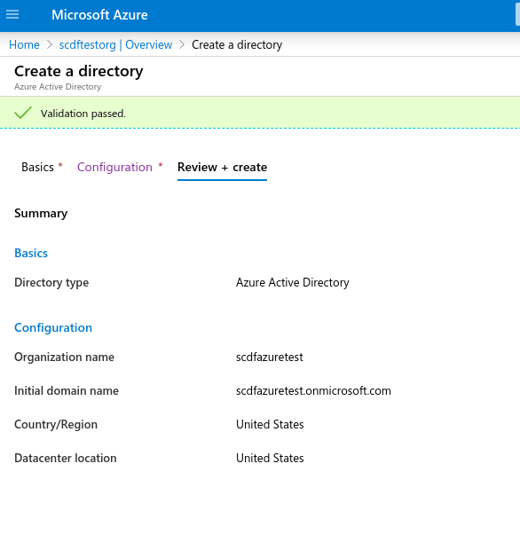
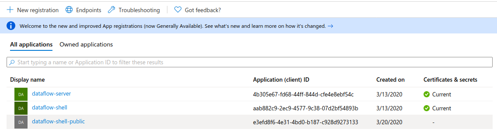
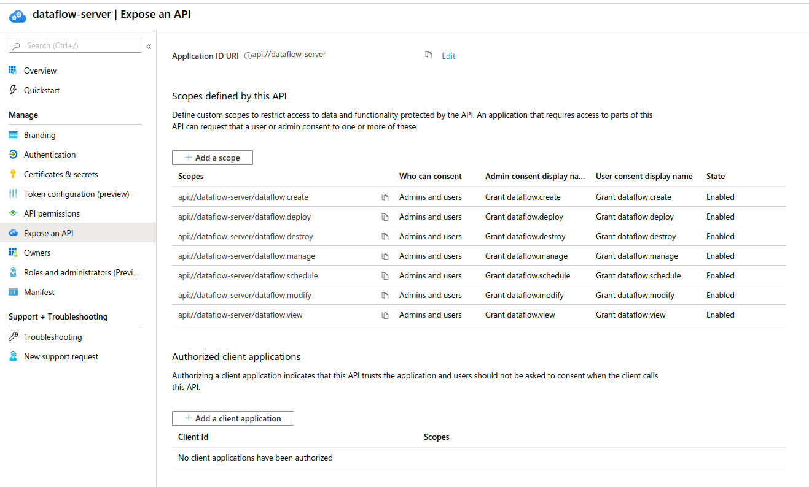
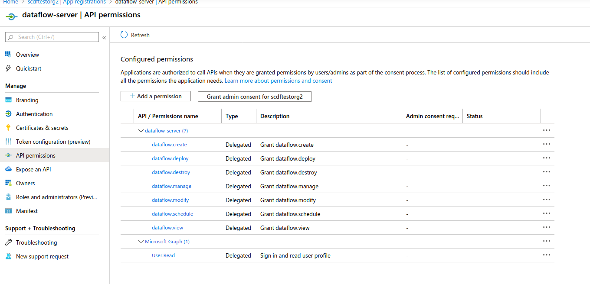
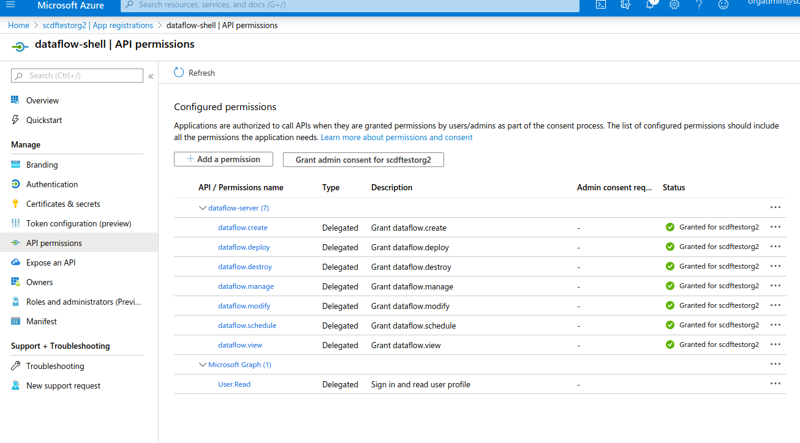
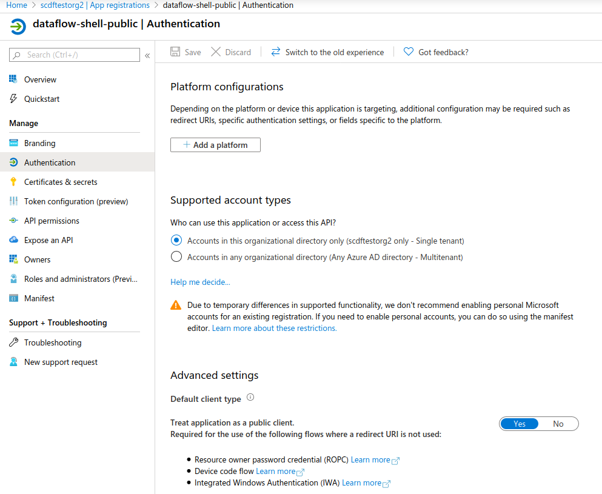

[[appendix-identity-provider-azure]]
=== Azure

Azure AD (Active Directory) is a fully fledged identity provider that provide a wide range of features
around authentication and authorization. As with any other provider, it has its
own nuances, meaning care must be taken to set it up.

In this section, we go through how OAuth2 setup is done for AD and
Spring Cloud Data Flow.

NOTE: You need full organization access rights to set up everything correctly.

[[appendix-identity-provider-azure-adenv]]
==== Creating a new AD Environment

To get started, create a new Active Directory environment. Choose a
type as Azure Active Directory (not the b2c type) and then pick your organization name and
initial domain. The following image shows the settings:

[[appendix-identity-provider-azure-appreg]]
==== Creating a New App Registration

App registration is where OAuth clients are created to get used by OAuth
applications. At minimum, you need to create two clients, one for the
Data Flow and Skipper servers and one for the Data Flow shell, as these two have
slightly different configurations. Server applications can be considered to be
trusted applications while shell is not trusted (because users can see its full
configuration).

NOTE:
We recommend using the same OAuth client for both the Data Flow and the Skipper servers. While
you can use different clients, it currently would not provide any value, as the
configurations needs to be the same.

The following image shows the settings for creating a a new app registration:

IMPORTANT: A client secret, when needed, is created under `Certificates & secrets` in AD.

[[appendix-identity-provider-azure-exposeapi]]
==== Expose Dataflow APIs

To prepare OAuth scopes, create one for each Data Flow security role. In this example, those would be

* `api://dataflow-server/dataflow.create`
* `api://dataflow-server/dataflow.deploy`
* `api://dataflow-server/dataflow.destroy`
* `api://dataflow-server/dataflow.manage`
* `api://dataflow-server/dataflow.schedule`
* `api://dataflow-server/dataflow.modify`
* `api://dataflow-server/dataflow.view`

The following image shows the APIs to expose:

Previously created scopes needs to be added as API Permissions, as the following image shows:

[[appendix-identity-provider-azure-privclient]]
==== Creating a Privileged Client

For the OAuth client, which is about to use password grants, the same API permissions need
to be created for the OAuth client as were used for the server (described in the previous section).

NOTE: All these permissions need to be granted with admin privileges.

The following image shows the privileged settings:

IMPORTANT: Privileged client needs a client secret, which needs to be exposed to a client
configuration when used in a shell. If you do not want to expose that secret, use the
<<appendix-identity-provider-azure-pubclient>> public client.

[[appendix-identity-provider-azure-pubclient]]
==== Creating a Public Client

A public client is basically a client without a client secret and with its type set to public.

The following image shows the configuration of a public client:

==== Configuration Examples

This section contains configuration examples for the Data Flow and Skipper servers and the shell.

To starting a Data Flow server:

====
[source,bash]
----
$ java -jar spring-cloud-dataflow-server.jar \
  --spring.config.additional-location=dataflow-azure.yml
----

[source,yaml]
.dataflow-azure.yml
----
spring:
  cloud:
    dataflow:
      security:
        authorization:
          provider-role-mappings:
            dataflow-server:
              map-oauth-scopes: true
              role-mappings:
                ROLE_VIEW: dataflow.view
                ROLE_CREATE: dataflow.create
                ROLE_MANAGE: dataflow.manage
                ROLE_DEPLOY: dataflow.deploy
                ROLE_DESTROY: dataflow.destroy
                ROLE_MODIFY: dataflow.modify
                ROLE_SCHEDULE: dataflow.schedule
  security:
    oauth2:
      client:
        registration:
          dataflow-server:
            provider: azure
            redirect-uri: '{baseUrl}/login/oauth2/code/{registrationId}'
            client-id: <client id>
            client-secret: <client secret>
            scope:
            - openid
            - profile
            - email
            - offline_access
            - api://dataflow-server/dataflow.view
            - api://dataflow-server/dataflow.deploy
            - api://dataflow-server/dataflow.destroy
            - api://dataflow-server/dataflow.manage
            - api://dataflow-server/dataflow.modify
            - api://dataflow-server/dataflow.schedule
            - api://dataflow-server/dataflow.create
        provider:
          azure:
            issuer-uri: https://login.microsoftonline.com/799dcfde-b9e3-4dfc-ac25-659b326e0bcd/v2.0
            user-name-attribute: name
      resourceserver:
        jwt:
          jwk-set-uri: https://login.microsoftonline.com/799dcfde-b9e3-4dfc-ac25-659b326e0bcd/discovery/v2.0/keys
----
====

To start a Skipper server:

====
[source,bash]
----
$ java -jar spring-cloud-skipper-server.jar \
  --spring.config.additional-location=skipper-azure.yml
----

[source,yaml]
.skipper-azure.yml
----
spring:
  cloud:
    skipper:
      security:
        authorization:
          provider-role-mappings:
            skipper-server:
              map-oauth-scopes: true
              role-mappings:
                ROLE_VIEW: dataflow.view
                ROLE_CREATE: dataflow.create
                ROLE_MANAGE: dataflow.manage
                ROLE_DEPLOY: dataflow.deploy
                ROLE_DESTROY: dataflow.destroy
                ROLE_MODIFY: dataflow.modify
                ROLE_SCHEDULE: dataflow.schedule
  security:
    oauth2:
      client:
        registration:
          skipper-server:
            provider: azure
            redirect-uri: '{baseUrl}/login/oauth2/code/{registrationId}'
            client-id: <client id>
            client-secret: <client secret>
            scope:
            - openid
            - profile
            - email
            - offline_access
            - api://dataflow-server/dataflow.view
            - api://dataflow-server/dataflow.deploy
            - api://dataflow-server/dataflow.destroy
            - api://dataflow-server/dataflow.manage
            - api://dataflow-server/dataflow.modify
            - api://dataflow-server/dataflow.schedule
            - api://dataflow-server/dataflow.create
        provider:
          azure:
            issuer-uri: https://login.microsoftonline.com/799dcfde-b9e3-4dfc-ac25-659b326e0bcd/v2.0
            user-name-attribute: name
      resourceserver:
        jwt:
          jwk-set-uri: https://login.microsoftonline.com/799dcfde-b9e3-4dfc-ac25-659b326e0bcd/discovery/v2.0/keys
----
====

To start a shell and (optionally) pass credentials as options:

====
[source,bash]
----
$ java -jar spring-cloud-dataflow-shell.jar \
  --spring.config.additional-location=dataflow-azure-shell.yml \
  --dataflow.username=<USERNAME> \
  --dataflow.password=<PASSWORD>
----

[source,yaml]
.dataflow-azure-shell.yml
----
  security:
    oauth2:
      client:
        registration:
          dataflow-shell:
            provider: azure
            client-id: <client id>
            client-secret: <client secret>
            authorization-grant-type: password
            scope:
            - offline_access
            - api://dataflow-server/dataflow.create
            - api://dataflow-server/dataflow.deploy
            - api://dataflow-server/dataflow.destroy
            - api://dataflow-server/dataflow.manage
            - api://dataflow-server/dataflow.modify
            - api://dataflow-server/dataflow.schedule
            - api://dataflow-server/dataflow.view
        provider:
          azure:
            issuer-uri: https://login.microsoftonline.com/799dcfde-b9e3-4dfc-ac25-659b326e0bcd/v2.0

----
====

Starting a public shell and (optionally) pass credentials as options:

====
[source,bash]
----
$ java -jar spring-cloud-dataflow-shell.jar \
  --spring.config.additional-location=dataflow-azure-shell-public.yml \
  --dataflow.username=<USERNAME> \
  --dataflow.password=<PASSWORD>
----

[source,yaml]
.dataflow-azure-shell-public.yml
----
spring:
  security:
    oauth2:
      client:
        registration:
          dataflow-shell:
            provider: azure
            client-id: <client id>
            authorization-grant-type: password
            client-authentication-method: post
            scope:
            - offline_access
            - api://dataflow-server/dataflow.create
            - api://dataflow-server/dataflow.deploy
            - api://dataflow-server/dataflow.destroy
            - api://dataflow-server/dataflow.manage
            - api://dataflow-server/dataflow.modify
            - api://dataflow-server/dataflow.schedule
            - api://dataflow-server/dataflow.view
        provider:
          azure:
            issuer-uri: https://login.microsoftonline.com/799dcfde-b9e3-4dfc-ac25-659b326e0bcd/v2.0
----
====
