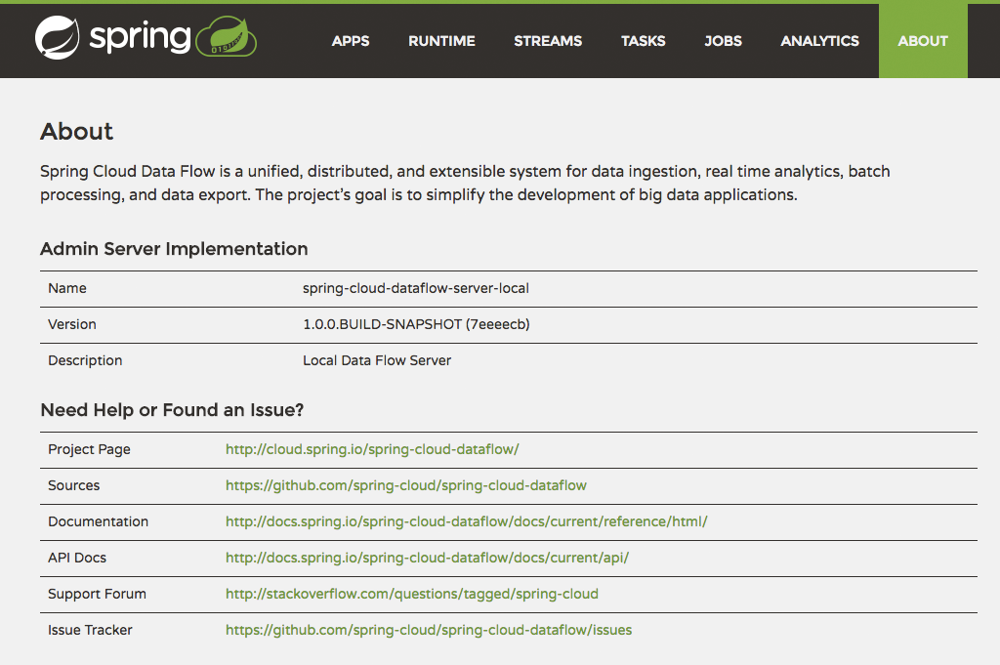
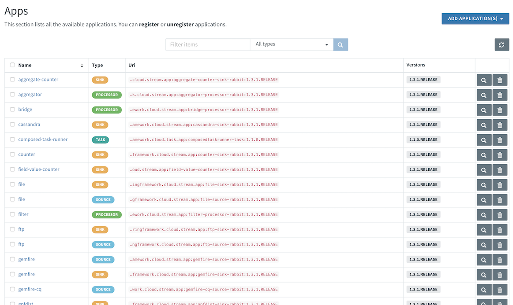
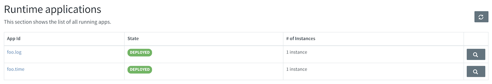
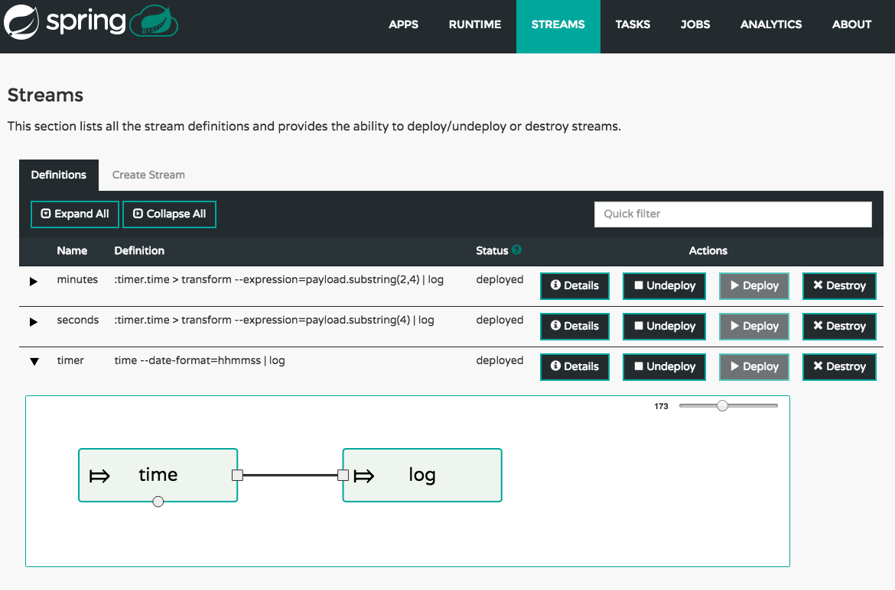
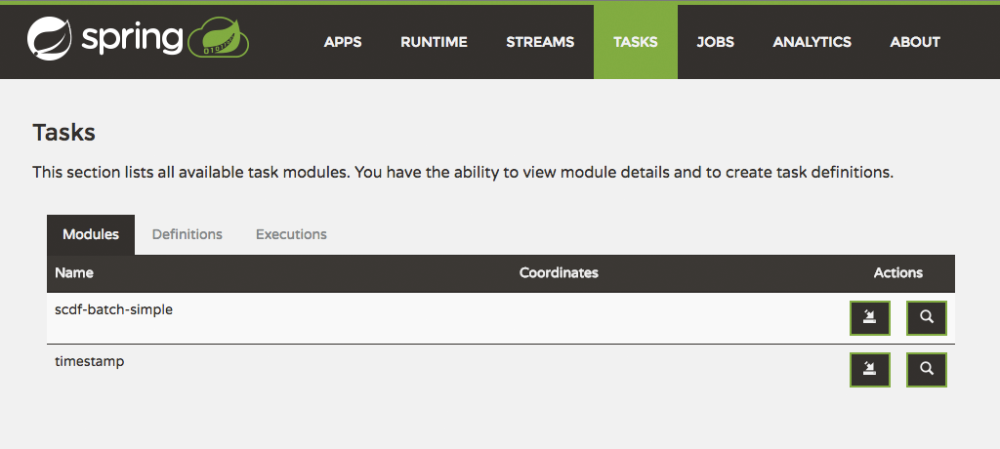
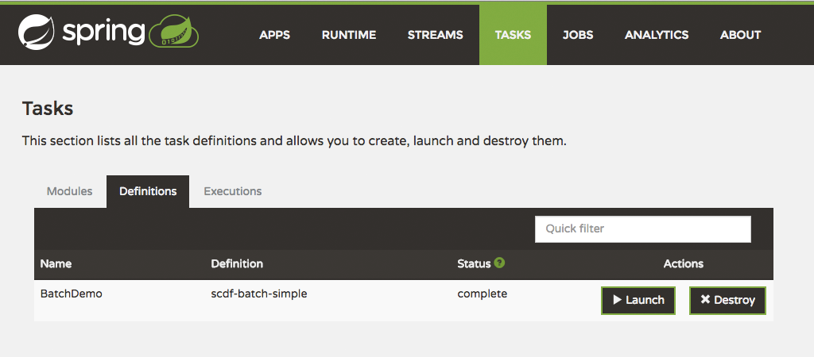
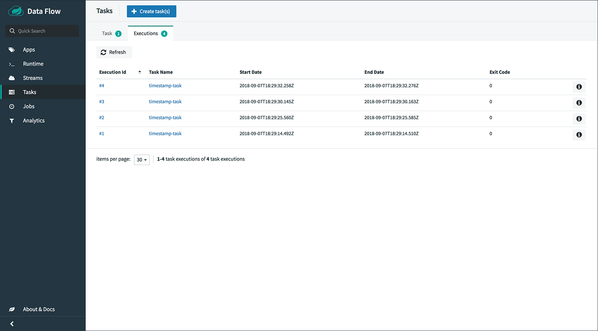
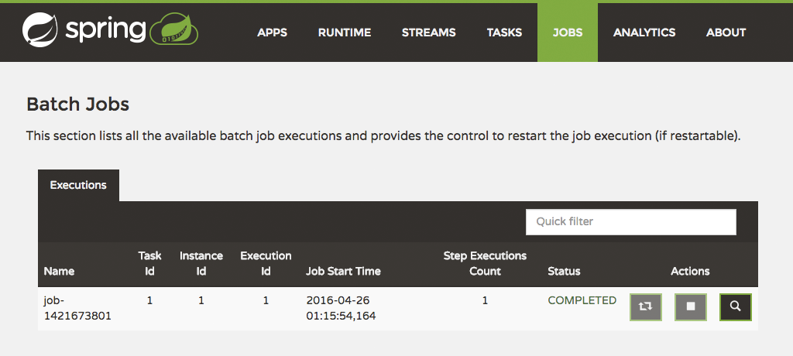
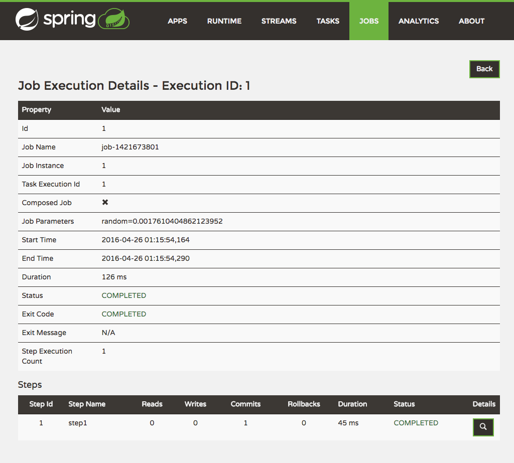
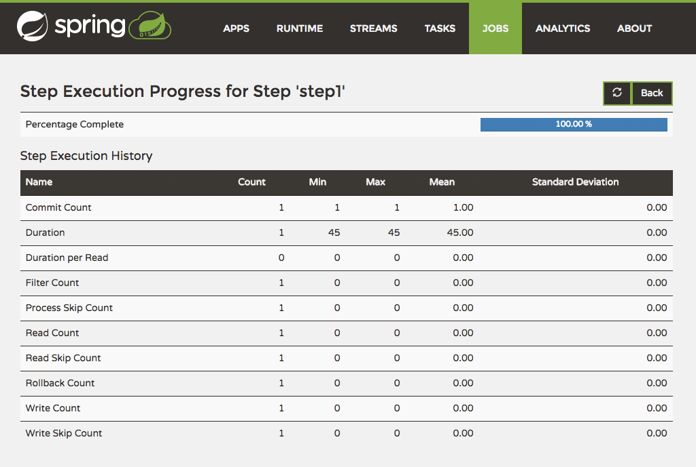

[[dashboard]]
= Dashboard

[partintro]
--
This section describe how to use the Dashboard of Spring Cloud Data Flow.
--

[[dashboard-introduction]]
== Introduction

Spring Cloud Data Flow provides a browser-based GUI which currently has 6 sections:

* **Apps** Lists all available applications and provides the control to register/unregister them
* **Runtime** Provides the Dataflow cluster view with the list of all running applications
* **Streams** Deploy/undeploy Stream Definitions
* **Tasks** List, create, launch and destroy Task Definitions
* **Jobs** Perform Batch Job related functions
* **Analytics** Create data visualizations for the various analytics modules

Upon starting Spring Cloud Data Flow, the Dashboard is available at:

`http://<adminHost>:<adminPort>/admin-ui`

For example: http://localhost:9393/admin-ui[http://localhost:9393/admin-ui]

If you have enabled https, then it will be located at `https://localhost:9393/admin-ui`.
If you have enabled security, a login form is available at `http://localhost:9393/admin-ui/#/login`.

**Note**: The default Dashboard server port is `9393`

.The Spring Cloud Data Flow Dashboard

[[dashboard-apps]]
== Apps

The _Apps_ section of the Dashboard lists all the available applications and
provides the control to register/unregister them (if applicable). By clicking on
the magnifying glass, you will get a listing of available definition properties.

.List of Available Applications

[[dashboard-runtime]]
== Runtime
The _Runtime_ section of the Dashboard application shows the Spring Cloud Data Flow
cluster view with the list of all running applications. For each runtime module the
state of the deployment and the number of deployed instances is shown.
A list of the used deployment properties is available by clicking on the
module id.

.List of Running Applications

[[dashboard-streams]]
== Streams

The _Streams_ section of the Dashboard provides the _Definitions_ tab that provides
a listing of Stream definitions. There you have the option to *deploy* or *undeploy*
those stream definitions. Additionally you can remove the definition by clicking on *destroy*.

.List of Stream Definitions

[[dashboard-tasks]]
== Tasks

The _Tasks_ section of the Dashboard currently has three tabs:

* Modules
* Definitions
* Executions

[[dashboard-tasks-modules]]
=== Modules

_Modules_ encapsulate a unit of work into a reusable component. Within the Dataflow
runtime environment Modules allow users to create definitions for _Streams_ as
well as _Tasks_. Consequently, the _Modules_ tab within the _Tasks_ section
allows users to create _Task_ definitions.

**Note**: You will also use this tab to create Batch Jobs.

.List of Task Modules

On this screen you can perform the following actions:

* View details such as the task module options.
* Create a Task Definition from the respective Module.

==== Create a Task Definition from a selected Job Module

On this screen you can create a new Task Definition. As a minimum you must provide a
name for the new definition. You will also have the option
to specify various parameters that are used during the deployment of the definition.

**Note**: Each parameter is only included if the _Include_ checkbox is selected.

==== View Task Module Details

On this page you can view the details of a selected task module. The pages lists
the available options (properties) of the modules.

[[dashboard-task-definition]]
=== Definitions

This page lists the Dataflow Task definitions and provides actions to *launch*
or *destroy* those tasks.

.List of Task Definitions

==== Launching Tasks

Once the task definition is created, they can be launched through the Dashboard
as well. Navigate to the *Definitions* tab. Select the Task you want to launch by
pressing `Launch`.

On the following screen, you can define one or more Task parameters by entering:

* Parameter Key
* Parameter Value

Task parameters are not typed.

[[dashboard-tasks-executions]]
=== Executions

.List of Task Executions

[[dashboard-jobs]]
== Jobs

The _Jobs_ section of the Dashboard allows you to inspect *Batch Jobs*. The main
section of the screen provides a list of Job Executions. *Batch Jobs*
are *Tasks* that were executing one or more *Batch Job*. As such each
Job Execution has a back reference to the *Task Execution Id* (Task Id).

In case of a failed job, you can also restart the task. When dealing with long-running
Batch Jobs, you can also request to stop it.

.List of Job Executions

[[dashboard-job-executions-list]]
=== List job executions

This page lists the Batch Job Executions and provides the option to *restart* or *stop* a specific job execution, provided the operation is available.
Furthermore, you have the option to view the Job execution details.

The list of Job Executions also shows the state of the underlying Job Definition.
Thus, if the underlying definition has been deleted, _deleted_ will be shown.

[[dashboard-job-executions-details]]
==== Job execution details

.Job Execution Details

The Job Execution Details screen also contains a list of the executed steps. You can
further drill into the _Step Execution Details_ by clicking onto the magnifying glass.

[[dashboard-job-executions-steps]]
==== Step execution details

On the top of the page, you will see progress indicator the respective step, with
the option to refresh the indicator. Furthermore, a link is provided to view the
_step execution history_.

The Step Execution details screen provides a complete list of all Step Execution
Context key/value pairs.

IMPORTANT: In case of exceptions, the _Exit Description_ field will contain
additional error information. Please be aware, though, that this field can only
have a maximum of *2500 characters*. Therefore, in case of long exception
stacktraces, trimming of error messages may occur. In that case, please refer to
the server log files for further details.

[[dashboard-job-executions-steps-progress]]
==== Step Execution Progress

On this screen, you can see a progress bar indicator in regards to the execution
of the current step. Under the *Step Execution History, you can also view various
metrics associated with the selected step such as *duration*, *read counts*, *write
counts* etc.

.Step Execution History

[[dashboard-analytics]]
== Analytics

The _Analytics_ section of the Dashboard provided data visualization capabilities
for the various analytics modules available in _Spring Cloud Data Flow_:

* Counters
* Field-Value Counters

For example, if you have created the `springtweets` stream and the corresponding
counter in the <<counter, Counter chapter>>, you can now easily create the corresponding
graph from within the **Dashboard** tab:

1. Under `Metric Type`, select `Counters` from the select box
2. Under `Stream`, select `tweetcount`
3. Under `Visualization`, select the desired chart option, `Bar Chart`

Using the icons to the right, you can add additional charts to the Dashboard,
re-arange the order of created dashboards or remove data visualizations.
