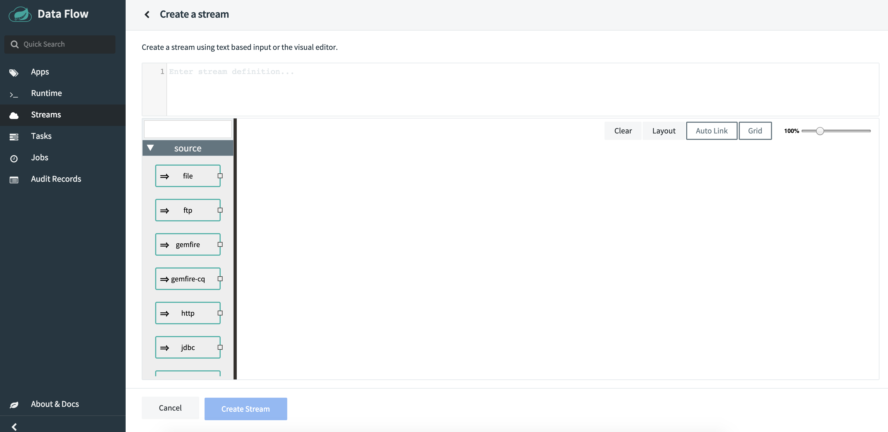
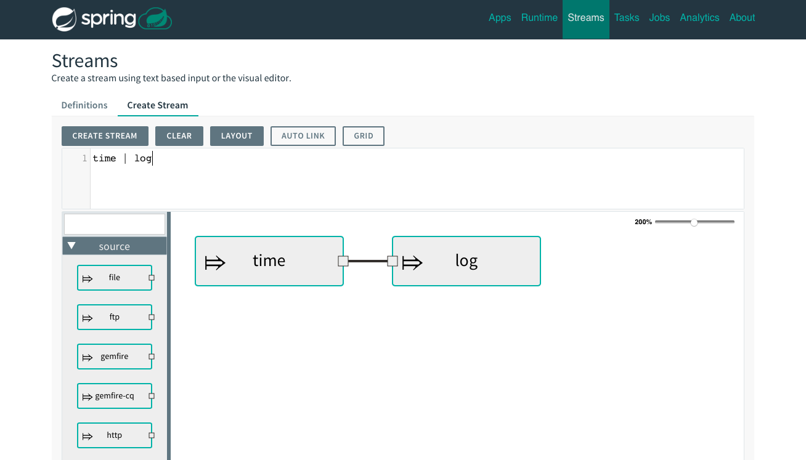
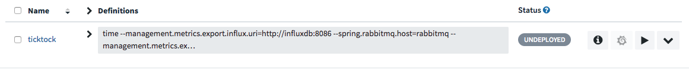
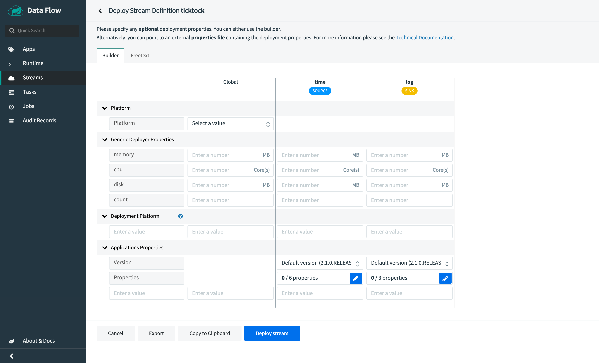

[[getting-started-local]]
== Getting Started - Local

[partintro]
--
If you are getting started with Spring Cloud Data Flow, this section is for you.
In this section, we answer the basic "`what?`", "`how?`" and "`why?`" questions.
You can find a gentle introduction to Spring Cloud Data Flow along with installation instructions.
We then build an introductory Spring Cloud Data Flow application, discussing some core principles as we go.
--

[[getting-started-local-system-requirements]]
=== System Requirements

You need Java 8 to run and to build you need to have Maven.

Both the Data Flow Server and Skipper Server need to have an RDBMS installed.  The Data Flow Server stores stream and task definitions.  It also stores the execution state of deployed tasks.  The Skipper server stores the execution state of deployed streams.

By default, the Data Flow server uses embedded H2 database for this purpose but you can easily configure the server to use another external database.

For the deployed streams applications communicate a messaging middleware product needs to be installed.
We provide prebuilt stream applications that use link:http://www.rabbitmq.com[RabbitMQ] or link:http://kafka.apache.org[Kafka], however other https://cloud.spring.io/spring-cloud-stream/#binder-implementations[messaging middleware products] are supported.

[[getting-started-local-deploying-spring-cloud-dataflow-docker]]
=== Getting Started with Docker Compose

Spring Cloud Data Flow provides a Docker Compose file to let you quickly bring up Spring Cloud Data Flow, Skipper, and the Apache Kafka broker, instead of having to install them manually.

NOTE: We recommended that you upgrade to the link:https://docs.docker.com/compose/install/[latest version] of Docker before running the `docker-compose` command. We have tested it against Docker Engine version `18.09.2`

The following sections describe how to get started with Docker Compose:

[[getting-started-local-deploying-spring-cloud-dataflow-docker-download]]
=== Downloading the Docker Compose File

Before you do anything else, you need to download the Docker Compose file. To do so:

. Download the Spring Cloud Data Flow Server Docker Compose file:
+
====
[source,bash,subs=attributes]
----
$ wget https://raw.githubusercontent.com/spring-cloud/spring-cloud-dataflow/{github-tag}/spring-cloud-dataflow-server/docker-compose.yml
----
====

NOTE: If the `wget` command is unavailable, you can use `curl` or another platform-specific utility. Alternatively, you can navigate to https://raw.githubusercontent.com/spring-cloud/spring-cloud-dataflow/{github-tag}/spring-cloud-dataflow-server/docker-compose.yml[https://raw.githubusercontent.com/spring-cloud/spring-cloud-dataflow/{github-tag}/spring-cloud-dataflow-server/docker-compose.yml] in a web browser and save the contents. Ensure the downloaded filename is `docker-compose.yml`.

[[getting-started-local-deploying-spring-cloud-dataflow-docker-starting]]
=== Starting Docker Compose

To get started, you need to start Docker Compose. To do so:

. In the directory where you downloaded `docker-compose.yml`, start the system, as follows:
+
====
[source,bash,subs=attributes]
----
$ export DATAFLOW_VERSION={local-server-image-tag}
$ export SKIPPER_VERSION={skipper-version}
$ docker-compose up
----
====

The `docker-compose.yml` file defines `DATAFLOW_VERSION` and `SKIPPER_VERSION` variables, so that those values can be easily changed. The preceding commands first set the `DATAFLOW_VERSION` and `SKIPPER_VERSION` to use in the environment. Then `docker-compose` is started.

You can also use a  shorthand version that exposes only the `DATAFLOW_VERSION` and `SKIPPER_VERSION` variables to the `docker-compose` process (rather than setting it in the environment), as follows:

====
[source,bash,subs=attributes]
----
$ DATAFLOW_VERSION={local-server-image-tag} SKIPPER_VERSION={skipper-version} docker-compose up
----
====

If you use Windows, environment variables are defined by using the `set` command. To start the system on Windows, enter the following commands:

====
[source,bash,subs=attributes]
----
C:\ set DATAFLOW_VERSION={local-server-image-tag}
C:\ set SKIPPER_VERSION={skipper-version}
C:\ docker-compose up
----
====

NOTE: By default, Docker Compose use locally available images.
For example, when using the `latest` tag, run `docker-compose pull` prior to `docker-compose up` to ensure the latest image is downloaded.

Spring Cloud Data Flow is ready for use once the `docker-compose` command stops emitting log messages.

[[getting-started-local-deploying-spring-cloud-dataflow-docker-launch]]
=== Launching Spring Cloud Data Flow

Now that docker compose is up, you can launch the Spring Cloud Data Flow Dashboard. To do so, in your browser, navigate to the link:http://localhost:9393/dashboard[Spring Cloud Data Flow Dashboard].
By default, the latest GA releases of Stream and Task applications are imported automatically.

[[getting-started-local-deploying-spring-cloud-dataflow-docker-create-stream]]
=== Creating a Stream

To create a stream:

. In the menu, click *Streams*.
. Click the *Create Stream(s)* button.
+
The screen changes to the following image:
+
.Create Stream Page

. In the text area, type `time | log`.
. Click *Create Stream*.
. Enter `ticktock` for the stream name, as shown in the following image:
+
.Creating a Stream

. Click "Create the stream" button.
+
The Definitions page appears.
+
.Definitions Page
image::images/dataflow-definitions-page.png[Definitions Page, scaledwidth="60%"]

[[getting-started-local-deploying-spring-cloud-dataflow-docker-deploy-stream]]
=== Deploying a Stream

Now that you have defined a stream, you can deploy it. To do so:

. Click the play (deploy) button next to the "`ticktock`" definition that you created in the previous section.
+
.Initiate Deployment of a Stream

+
The UI shows the available properties that can be applied to the apps in the "`ticktock`" stream.
This example shown in the following image uses the defaults:
+
.Deployment Page

. Click the *Deploy Stream* button.
+
The UI returns to the Definitions page.
+
The stream is now in "`deploying`" status, and its status becomes "`deployed`" when it is finished deploying.
You may need to refresh your browser to see the updated status.

[[getting-started-local-deploying-spring-cloud-dataflow-docker-viewing-stream-logs]]
=== Viewing Stream Logs

Once a stream is deployed, you can view its logs. To do so:

. Click *Runtime* in the menu.
. Click "`ticktock.log`".
. Copy the path in the "`stdout`" text box on the dashboard
. In another console window, type the following, replacing `/path/from/stdout/textbox/in/dashboard` with the value you copied in the previous step:
+
====
[source,bash,subs=attributes]
----
$ docker exec -it skipper tail -f /path/from/stdout/textbox/in/dashboard
----
====
+
The output of the log sink appears in the new window, printing a timestamp once per second.
. When you have seen enough of that output, press Ctrl+C to end the `tail` command.
[[getting-started-local-deploying-spring-cloud-dataflow-docker-deleting-stream]]

=== Deleting a Stream

Now you can delete the stream you created. To do so:

. Click *Streams* in the menu.
. Click the down chevron on the "`ticktock`" row.
. Click the *Destroy Stream*.
. When prompted for confirmation, click *Destroy Stream Definition(s)*.

=== Destroying the Quick Start Environment

You have finished the getting started guide for using Docker locally, so you can now shut down the environment you created by running `docker-compose up`. To do so:

. Open a new terminal window.
. Change directory to the directory in which you started (where the `docker-compose.yml` file is located).
. Run the following command:
+
====
[source,bash,subs=attributes]
----
$ DATAFLOW_VERSION={local-server-image-tag} SKIPPER_VERSION={skipper-version} docker-compose down
----
====
+
(You need to specify the `DATAFLOW_VERSION` and the `SKIPPER_VERSION` because you are running the command in a separate terminal window. The `export` commands you used earlier set the variables for only that terminal window, so those values are not found in the new terminal window. If all else fails, you can shut it down with Ctrl+C. Don't do that for non-demo instances, though.s)

NOTE: Some stream applications may open a port, for example `http --server.port=`. By default, a port range of `9000-9010` is exposed from the container to the host. If you would need to change this range, you can modify the `ports` block of the `dataflow-server` service in the `docker-compose.yml` file.

[[getting-started-local-customizing-spring-cloud-dataflow-docker]]

==== Spring Cloud Data Flow Shell

For convenience and as an alternative to using the Spring Cloud Data Flow Dashboard, Spring Cloud Data Flow Shell is also included in the springcloud/spring-cloud-dataflow-server Docker image.
To use it, open another console window and type the following:

====
[source,bash]
----
$ docker exec -it dataflow-server java -jar shell.jar
----
====

Using Spring Cloud Data Flow Shell is further described in <<shell,Shell>>.

==== Spring Cloud Data Flow Monitoring

By default, the Data Flow `docker-compose` configures Stream monitoring with InfluxDB and pre-built dashboards for Grafana.

For further instructions about Data Flow monitoring, see <<streams-monitoring-local-influx,Streams Monitoring InfluxDB >>.

image::{dataflow-asciidoc}/images/grafana-influxdb-scdf-streams-dashboard.png[Grafana InfluxDB Dashboard, scaledwidth="50%"]

==== Docker Compose Customization

Out of the box, Spring Cloud Data Flow uses the H2 embedded database for storing state and Kafka for communication.
You can make customizations to these components by editing the `docker-compose.yml` file. To do so:

[[getting-started-local-customizing-spring-cloud-dataflow-docker-mysql]]
===== Using MySQL Rather than the H2 Embedded Database

You can use MySQL rather than the H2 embedded database.
To do so:

. Add the following configuration under the `services` section:
+
====
[source,yaml,subs=attributes]
----
  mysql:
    image: mysql:5.7.25
    environment:
      MYSQL_DATABASE: dataflow
      MYSQL_USER: root
      MYSQL_ROOT_PASSWORD: rootpw
    expose:
      - 3306
----
====

. Add the following entries to the `environment` block of the `dataflow-server` service definition:
+
====
[source,yaml,subs=attributes]
----
      - spring.datasource.url=jdbc:mysql://mysql:3306/dataflow
      - spring.datasource.username=root
      - spring.datasource.password=rootpw
      - spring.datasource.driver-class-name=org.mariadb.jdbc.Driver
----
====

[[getting-started-local-customizing-spring-cloud-dataflow-docker-rabbitmq]]
===== Using RabbitMQ Instead of Kafka for Communication

You can use RabbitMQ rather than Kafka for communication. To do so:

. Replace the following configuration under the `services` section:
+
====
[source,yaml,subs=attributes]
----
  kafka:
    image: wurstmeister/kafka:2.11-0.11.0.3
    expose:
      - "9092"
    environment:
      - KAFKA_ADVERTISED_PORT=9092
      - KAFKA_ZOOKEEPER_CONNECT=zookeeper:2181
      - KAFKA_ADVERTISED_HOST_NAME=kafka
  zookeeper:
    image: wurstmeister/zookeeper
    expose:
      - "2181"
----
====
+
With the following:
+
====
[source,yaml,subs=attributes]
----
  rabbitmq:
    image: rabbitmq:3.7
    expose:
      - "5672"
----
====

. In the `dataflow-server` services configuration block, add the following `environment` entry:
+
====
[source,yaml,subs=attributes]
----
      - spring.cloud.dataflow.applicationProperties.stream.spring.rabbitmq.host=rabbitmq
----
====

. Replace the following:
+
====
[source,yaml,subs=attributes]
----
    depends_on:
      - kafka
----
====
+
With:
+
[source,yaml,subs=attributes]
====
----
    depends_on:
      - rabbitmq
----
====

. Modify the `app-import` service definition `command` attribute to replace `http://bit.ly/Einstein-SR2-stream-applications-kafka-maven` with `http://bit.ly/Einstein-SR2-stream-applications-rabbit-maven`.

[[getting-started-local-customizing-spring-cloud-dataflow-docker-mysql]]
===== Enabling App Starters from the Host

You can enable `app starters` registration directly from the host machine.
To do so:

. Mount the source host folders to the `dataflow-server` container.
+
For example, if the `my-app.jar` is in the `/thing1/thing2/apps` folder on your host machine, add the following `volumes` block to the `dataflow-server` service definition:
+
[source,yaml,subs=attributes]
====
----
  dataflow-server:
    image: springcloud/spring-cloud-dataflow-server:${DATAFLOW_VERSION}
    container_name: dataflow-server
    ports:
      - "9393:9393"
    environment:
      - spring.cloud.dataflow.applicationProperties.stream.spring.cloud.stream.kafka.binder.brokers=kafka:9092
      - spring.cloud.dataflow.applicationProperties.stream.spring.cloud.stream.kafka.binder.zkNodes=zookeeper:2181
    volumes:
      - /foo/bar/apps:/root/apps
----
====

This configuration provides access to the `my-app.jar` (and the other files in the folder) from within container's `/root/apps/` folder. See the https://docs.docker.com/compose/compose-file/compose-file-v2/[compose-file reference] for further configuration details.

NOTE: The explicit volume mounting couples  docker-compose to your host's file system, limiting the portability to other machines and operating systems. Unlike `docker`, `docker-compose` does not allow volume mounting from the command line (for example, no `-v` parameter). Instead, you can define a placeholder environment variable (such as `HOST_APP_FOLDER`) in place of the hardcoded path by using `- ${HOST_APP_FOLDER}:/root/apps` and setting this variable before starting docker-compose.

Once you mount the host folder, you can register the app starters (from `/root/apps`), with the SCDF  https://docs.spring.io/spring-cloud-dataflow/docs/current/reference/htmlsingle/#shell[Shell] or https://docs.spring.io/spring-cloud-dataflow/docs/current/reference/htmlsingle/#dashboard-apps[Dashboard] by using the `file://` URI schema.
The following example shows how to do so:

====
[source,bash,subs=attributes]
----
dataflow:>app register --type source --name my-app --uri file://root/apps/my-app-1.0.0.RELEASE.jar
----
====

NOTE: You also need to use `--metadata-uri` if the metadata jar is available in the /root/apps.

To access the host's local maven repository from within the `dataflow-server` container, you should mount the host maven local repository (defaults to `~/.m2` for OSX and Linux and `C:\Documents and Settings\{your-username}\.m2` for Windows) to a `dataflow-server` volume called `/root/.m2/`. For MacOS or Linux host machines, this looks like the following:

====
[source,yaml,subs=attributes]
----
  dataflow-server:
  .........
    volumes:
      - ~/.m2:/root/.m2
----
====

Now you can use the `maven://` URI schema and Maven coordinates to resolve jars installed in the host's maven repository, as the following example shows:

====
[source,bash,subs=attributes]
----
dataflow:>app register --type processor --name pose-estimation --uri maven://org.springframework.cloud.stream.app:pose-estimation-processor-rabbit:2.0.2.BUILD-SNAPSHOT --metadata-uri maven://org.springframework.cloud.stream.app:pose-estimation-processor-rabbit:jar:metadata:2.0.2.BUILD-SNAPSHOT
----
====

This approach lets you share jars that are built and installed on the host machine (for example, by using `mvn clean install`) directly with the dataflow-server container.

You can also pre-register the apps directly in the docker-compose. For every pre-registered app starer, add an additional `wget` statement to the `app-import` block configuration, as the following example shows:

====
[source,yaml,subs=attributes]
----
  app-import:
    image: alpine:3.7
    command: >
      /bin/sh -c "
        ....
        wget -qO- 'http://dataflow-server:9393/apps/source/my-app' --post-data='uri=file:/root/apps/my-app.jar&metadata-uri=file:/root/apps/my-app-metadata.jar';
        echo 'My custom apps imported'"
----
====

See the https://docs.spring.io/spring-cloud-dataflow/docs/current/reference/htmlsingle/#resources-registered-applications[SCDF REST API] for further details.

[[getting-started-local-deploying-spring-cloud-dataflow]]
=== Getting Started with Manual Installation

If Docker does not suit your needs, you can manually install the parts you need to run Spring Cloud Data Flow. To do so:

. Download the Spring Cloud Data Flow Server by using the following command:
+
====
[source,bash,subs=attributes]
----
wget https://repo.spring.io/{version-type-lowercase}/org/springframework/cloud/spring-cloud-dataflow-server/{project-version}/spring-cloud-dataflow-server-{project-version}.jar
----
====

. Download the Spring Cloud Data Flow Shell application by using the following command:
+
====
[source,bash,subs=attributes]
----
wget https://repo.spring.io/{version-type-lowercase}/org/springframework/cloud/spring-cloud-dataflow-shell/{project-version}/spring-cloud-dataflow-shell-{project-version}.jar
----
====

. If you need to enable Stream features, download http://cloud.spring.io/spring-cloud-skipper/[Skipper] (because Data Flow delegates to Skipper for those features), by running the following commands:
+
====
[source,yaml,options=nowrap,subs=attributes]
----
wget https://repo.spring.io/{skipper-version-type-lowercase}/org/springframework/cloud/spring-cloud-skipper-server/{skipper-version}/spring-cloud-skipper-server-{skipper-version}.jar

wget https://repo.spring.io/{skipper-version-type-lowercase}/org/springframework/cloud/spring-cloud-skipper-shell/{skipper-version}/spring-cloud-skipper-shell-{skipper-version}.jar
----
====

IMPORTANT: These instructions require that RabbitMQ be running on the same machine as Skipper and the Spring Cloud Data Flow server and shell.

. Launch Skipper (required unless the Stream features are disabled and the Spring Cloud Data Flow runs in Task mode only). To do so, in the directory where you downloaded Skipper, run the server by using `java -jar`, as follows:
+
====
[source,bash,subs=attributes]
----
$ java -jar spring-cloud-skipper-server-{skipper-version}.jar
----
====

. Launch the Data Flow Server
+
In a different terminal window and in the directory where you downloaded Data Flow, run the server by using `java -jar`, as follows:
+
====
[source,bash,subs=attributes]
----
$ java -jar spring-cloud-dataflow-server-{project-version}.jar
----
====
+
If Skipper and the Data Flow server are not running on the same host, set the `spring.cloud.skipper.client.serverUri` configuration property to the location of Skipper, as shown in the following example
+
====
[source,bash,subs=attributes]
----
$ java -jar spring-cloud-dataflow-server-{project-version}.jar --spring.cloud.skipper.client.serverUri=http://192.51.100.1:7577/api
----
====

. In another terminal window, launch the Data Flow Shell by running the following command:
+
====
[source,bash,subs=attributes]
----
$ java -jar spring-cloud-dataflow-shell-{project-version}.jar
----
====

If the Data Flow Server and shell are not running on the same host, you can also point the shell to the Data Flow server URL by using the `dataflow config server` command when in the shell's interactive mode.

If the Data Flow Server and shell are not running on the same host, point the shell to the Data Flow server URL, as the following example shows:

====
[source,bash]
----
server-unknown:>dataflow config server http://198.51.100.0
Successfully targeted http://198.51.100.0
dataflow:>
----
====

Alternatively, you can pass in the `--dataflow.uri` command line option.  The shell's `--help` command line option shows what is available.

IMPORTANT: If you run Spring Cloud Data Flow Server behind a proxy server (such as
https://github.com/Netflix/zuul[Zuul]), you may also need to set the
`server.use-forward-headers` property to `true`. An example that uses Zuul is available in the
https://github.com/spring-cloud/spring-cloud-dataflow-samples/tree/master/dataflow-zuul[Spring Cloud Data Flow Samples repository]
on GitHub. Additional information is also available in the
https://docs.spring.io/spring-boot/docs/current/reference/htmlsingle/#howto-use-tomcat-behind-a-proxy-server[Spring Boot Reference Guide].

[[getting-started-local-deploying-streams-spring-cloud-dataflow]]
=== Deploying Streams

Deploying streams requires that you first register some stream applications. By default, the application registry is empty.
As an example, register two applications, `http` and `log`, that communicate by using RabbitMQ. To do so, run the following commands:

====
[source,bash]
----
dataflow:>app register --name http --type source --uri maven://org.springframework.cloud.stream.app:http-source-rabbit:1.2.0.RELEASE
Successfully registered application 'source:http'

dataflow:>app register --name log --type sink --uri maven://org.springframework.cloud.stream.app:log-sink-rabbit:1.1.0.RELEASE
Successfully registered application 'sink:log'
----
====

For more details, such as how to register applications that are based on Docker containers or use Kafka as the messaging middleware, see the section on how to <<streams.adoc#spring-cloud-dataflow-register-stream-apps, register applications>>.

NOTE: Depending on your environment, you may need to configure the Data Flow Server to point to a custom
Maven repository location or configure proxy settings.  See <<configuration-maven>> for more information.

Now that you have stream applications, you can create a stream. To do so, use the following `stream create` command to create a stream with a `http` source and a `log` sink and deploy it:

====
[source,bash]
----
dataflow:>stream create --name httptest --definition "http --server.port=9000 | log" --deploy
----
====

NOTE: You need to wait a little while, until the apps are actually deployed successfully, before posting data.
You can look in the log file of the Skipper server for the location of the log files for the `http` and `log` applications.
You can use the `tail` command on the log file for each application to verify that the application has started.

Once the stream has started, you can post some data, as shown in the following example:

====
[source,bash]
----
dataflow:>http post --target http://localhost:9000 --data "hello world"
----
====

Now you should check to see if `hello world` ended up in log files for the `log` application.
The location of the log file for the `log` application appears in the Data Flow server's log.

NOTE: When deploying locally, each app (and each app instance, in case of `count > 1`) gets a dynamically assigned `server.port`, unless you explicitly assign one with `--server.port=x`.
In both cases, this setting is propagated as a configuration property that overrides any lower-level setting that you may have used (for example, in `application.yml` files).

The following sections show how to update and roll back streams by using the Local Data Flow server and Skipper.
If you run the Unix `jps` command, you can see the two Java processes running, as shown in the following listing:

====
[source,bash]
----
$ jps | grep rabbit
12643 log-sink-rabbit-1.1.0.RELEASE.jar
12645 http-source-rabbit-1.2.0.RELEASE.jar
----
====

[[getting-started-local-spring-cloud-dataflow-streams-upgrading]]
==== Upgrading

Before we start upgrading the log-sink version to 1.2.0.RELEASE, we have to register that version in the app registry.
The following command does so:

====
[source,bash]
----
dataflow:>app register --name log --type sink --uri maven://org.springframework.cloud.stream.app:log-sink-rabbit:1.2.0.RELEASE
Successfully registered application 'sink:log'
----
====

Since we are using the local server, we need to set the port to a different value (9002) than the currently running log sink's value of 9000 to avoid a conflict.
While we are at it, we update the log level to `ERROR`.
To do so, we create a YAML file, named `local-log-update.yml`, with the following contents:

====
[source,yml]
----
version:
  log: 1.2.0.RELEASE
app:
  log:
    server.port: 9002
    log.level: ERROR
----
====

Now we can update the stream, as follows:

====
[source,bash]
----
dataflow:> stream update --name httptest --propertiesFile /home/mpollack/local-log-update.yml
Update request has been sent for the stream 'httptest'
----
====

By running the Unix `jps` command, you can see the two Java processes running, but now the log application is version 1.2.0.RELEASE, as shown in the following listing:

====
[source,bash]
----
$ jps | grep rabbit
22034 http-source-rabbit-1.2.0.RELEASE.jar
22031 log-sink-rabbit-1.1.0.RELEASE.jar
----
====

Now you can look in the log file of the Skipper server.
To do so, use the following commands (note that the directory names may not exactly match this example, because the numeric prefix changes):

====
[source,bash]
----
cd /tmp/spring-cloud-dataflow-5262910238261867964/httptest-1511749222274/httptest.log-v2
tail -f stdout_0.log
----
====

You should see log entries similar to the following:

====
[source,bash,options=nowrap]
----
INFO 12591 --- [  StateUpdate-1] o.s.c.d.spi.local.LocalAppDeployer       : Deploying app with deploymentId httptest.log-v2 instance 0.
   Logs will be in /tmp/spring-cloud-dataflow-5262910238261867964/httptest-1511749222274/httptest.log-v2
INFO 12591 --- [  StateUpdate-1] o.s.c.s.s.d.strategies.HealthCheckStep   : Waiting for apps in release httptest-v2 to be healthy.
INFO 12591 --- [  StateUpdate-1] o.s.c.s.s.d.s.HandleHealthCheckStep      : Release httptest-v2 has been DEPLOYED
INFO 12591 --- [  StateUpdate-1] o.s.c.s.s.d.s.HandleHealthCheckStep      : Apps in release httptest-v2 are healthy.
----
====

Now you can post a message to the http source at port `9000`, as follows:

====
[source,bash]
----
dataflow:> http post --target http://localhost:9000 --data "hello world upgraded"
----
====

The log message is now at the error level, as shown in the following example:

====
[source,bash]
----
ERROR 22311 --- [http.httptest-1] log-sink  : hello world upgraded
----
====

If you query the `/info` endpoint of the application, you can also see that it is at version `1.2.0.RELEASE`, as shown in the following example:

====
[source,bash]
----
$ curl http://localhost:9002/info
{"app":{"description":"Spring Cloud Stream Log Sink Rabbit Binder Application","name":"log-sink-rabbit","version":"1.2.0.RELEASE"}}
----
====

===== Forcing the Upgrade of a Stream

When upgrading a stream, you can use the `--force` option to deploy new instances of currently deployed applications even if no application or deployment properties have changed.
This behavior is needed when configuration information is obtained by the application itself at startup time -- for example, from Spring Cloud Config Server.
You can specify which applications to force upgrade by using the `--app-names` option.
If you do not specify any application names, all the applications are force upgraded.
You can specify the `--force` and `--app-names` options together with `--properties` or `--propertiesFile` the options.

===== Overriding Properties During Stream Update

The properties that are passed during stream update are added on top of the existing properties for the same stream.

For instance, the `ticktock` stream is deployed without any explicit properties, as follows:

====
[source,bash]
----
dataflow:>stream create --name ticktock --definition "time | log --name=mylogger"
Created new stream 'ticktock'

dataflow:>stream deploy --name ticktock
Deployment request has been sent for stream 'ticktock'
----
====

You can view the manifest for the `ticktock` stream by using the `stream manifest` command, as the following example shows:

====
[source,bash]
----
dataflow:>stream manifest --name ticktock
"apiVersion": "skipper.spring.io/v1"
"kind": "SpringCloudDeployerApplication"
"metadata":
  "name": "time"
"spec":
  "resource": "maven://org.springframework.cloud.stream.app:time-source-rabbit"
  "resourceMetadata": "maven://org.springframework.cloud.stream.app:time-source-rabbit:jar:metadata:1.3.1.RELEASE"
  "version": "1.3.1.RELEASE"
  "applicationProperties":
    "spring.metrics.export.triggers.application.includes": "integration**"
    "spring.cloud.dataflow.stream.app.label": "time"
    "spring.cloud.stream.metrics.key": "ticktock.time.${spring.cloud.application.guid}"
    "spring.cloud.stream.bindings.output.producer.requiredGroups": "ticktock"
    "spring.cloud.stream.metrics.properties": "spring.application.name,spring.application.index,spring.cloud.application.*,spring.cloud.dataflow.*"
    "spring.cloud.stream.bindings.output.destination": "ticktock.time"
    "spring.cloud.dataflow.stream.name": "ticktock"
    "spring.cloud.dataflow.stream.app.type": "source"
  "deploymentProperties":
    "spring.cloud.deployer.group": "ticktock"
---
"apiVersion": "skipper.spring.io/v1"
"kind": "SpringCloudDeployerApplication"
"metadata":
  "name": "log"
"spec":
  "resource": "maven://org.springframework.cloud.stream.app:log-sink-rabbit"
  "resourceMetadata": "maven://org.springframework.cloud.stream.app:log-sink-rabbit:jar:metadata:1.3.1.RELEASE"
  "version": "1.3.1.RELEASE"
  "applicationProperties":
    "spring.metrics.export.triggers.application.includes": "integration**"
    "spring.cloud.dataflow.stream.app.label": "log"
    "spring.cloud.stream.metrics.key": "ticktock.log.${spring.cloud.application.guid}"
    "spring.cloud.stream.bindings.input.group": "ticktock"
    "log.name": "mylogger"
    "spring.cloud.stream.metrics.properties": "spring.application.name,spring.application.index,spring.cloud.application.*,spring.cloud.dataflow.*"
    "spring.cloud.dataflow.stream.name": "ticktock"
    "spring.cloud.dataflow.stream.app.type": "sink"
    "spring.cloud.stream.bindings.input.destination": "ticktock.time"
  "deploymentProperties":
    "spring.cloud.deployer.group": "ticktock"
----
====

In the second update, we try to add a new property for a `log` application called `foo2=bar2`, as the following example shows:

====
[source,bash]
----
dataflow:>stream update --name ticktock --properties app.log.foo2=bar2
Update request has been sent for the stream 'ticktock'

dataflow:>stream manifest --name ticktock
"apiVersion": "skipper.spring.io/v1"
"kind": "SpringCloudDeployerApplication"
"metadata":
  "name": "time"
"spec":
  "resource": "maven://org.springframework.cloud.stream.app:time-source-rabbit"
  "resourceMetadata": "maven://org.springframework.cloud.stream.app:time-source-rabbit:jar:metadata:1.3.1.RELEASE"
  "version": "1.3.1.RELEASE"
  "applicationProperties":
    "spring.metrics.export.triggers.application.includes": "integration**"
    "spring.cloud.dataflow.stream.app.label": "time"
    "spring.cloud.stream.metrics.key": "ticktock.time.${spring.cloud.application.guid}"
    "spring.cloud.stream.bindings.output.producer.requiredGroups": "ticktock"
    "spring.cloud.stream.metrics.properties": "spring.application.name,spring.application.index,spring.cloud.application.*,spring.cloud.dataflow.*"
    "spring.cloud.stream.bindings.output.destination": "ticktock.time"
    "spring.cloud.dataflow.stream.name": "ticktock"
    "spring.cloud.dataflow.stream.app.type": "source"
  "deploymentProperties":
    "spring.cloud.deployer.group": "ticktock"
---
"apiVersion": "skipper.spring.io/v1"
"kind": "SpringCloudDeployerApplication"
"metadata":
  "name": "log"
"spec":
  "resource": "maven://org.springframework.cloud.stream.app:log-sink-rabbit"
  "resourceMetadata": "maven://org.springframework.cloud.stream.app:log-sink-rabbit:jar:metadata:1.3.1.RELEASE"
  "version": "1.3.1.RELEASE"
  "applicationProperties":
    "spring.metrics.export.triggers.application.includes": "integration**"
    "spring.cloud.dataflow.stream.app.label": "log"
    "spring.cloud.stream.metrics.key": "ticktock.log.${spring.cloud.application.guid}"
    "spring.cloud.stream.bindings.input.group": "ticktock"
    "log.name": "mylogger"
    "spring.cloud.stream.metrics.properties": "spring.application.name,spring.application.index,spring.cloud.application.*,spring.cloud.dataflow.*"
    "spring.cloud.dataflow.stream.name": "ticktock"
    "spring.cloud.dataflow.stream.app.type": "sink"
    "foo2": "bar2" // <1>
    "spring.cloud.stream.bindings.input.destination": "ticktock.time"
  "deploymentProperties":
    "spring.cloud.deployer.count": "1"
    "spring.cloud.deployer.group": "ticktock"

dataflow:>stream list
╔═══════════╤══════════════════════════════════════════╤═════════════════════════════════════════╗
║Stream Name│            Stream Definition             │                 Status                  ║
╠═══════════╪══════════════════════════════════════════╪═════════════════════════════════════════╣
║ticktock   │time | log --log.name=mylogger --foo2=bar2│The stream has been successfully deployed║
╚═══════════╧══════════════════════════════════════════╧═════════════════════════════════════════╝

----

<1> Property `foo2=bar2` is applied for the `log` application.
====

Now, when we add another property `foo3=bar3` to the `log` application, this new property is added on top of the existing properties for the stream `ticktock`. The following example shows the command to do so and the result:

====
[source,bash]
----
dataflow:>stream update --name ticktock --properties app.log.foo3=bar3
Update request has been sent for the stream 'ticktock'

dataflow:>stream manifest --name ticktock
"apiVersion": "skipper.spring.io/v1"
"kind": "SpringCloudDeployerApplication"
"metadata":
  "name": "time"
"spec":
  "resource": "maven://org.springframework.cloud.stream.app:time-source-rabbit"
  "resourceMetadata": "maven://org.springframework.cloud.stream.app:time-source-rabbit:jar:metadata:1.3.1.RELEASE"
  "version": "1.3.1.RELEASE"
  "applicationProperties":
    "spring.metrics.export.triggers.application.includes": "integration**"
    "spring.cloud.dataflow.stream.app.label": "time"
    "spring.cloud.stream.metrics.key": "ticktock.time.${spring.cloud.application.guid}"
    "spring.cloud.stream.bindings.output.producer.requiredGroups": "ticktock"
    "spring.cloud.stream.metrics.properties": "spring.application.name,spring.application.index,spring.cloud.application.*,spring.cloud.dataflow.*"
    "spring.cloud.stream.bindings.output.destination": "ticktock.time"
    "spring.cloud.dataflow.stream.name": "ticktock"
    "spring.cloud.dataflow.stream.app.type": "source"
  "deploymentProperties":
    "spring.cloud.deployer.group": "ticktock"
---
"apiVersion": "skipper.spring.io/v1"
"kind": "SpringCloudDeployerApplication"
"metadata":
  "name": "log"
"spec":
  "resource": "maven://org.springframework.cloud.stream.app:log-sink-rabbit"
  "resourceMetadata": "maven://org.springframework.cloud.stream.app:log-sink-rabbit:jar:metadata:1.3.1.RELEASE"
  "version": "1.3.1.RELEASE"
  "applicationProperties":
    "spring.metrics.export.triggers.application.includes": "integration**"
    "spring.cloud.dataflow.stream.app.label": "log"
    "spring.cloud.stream.metrics.key": "ticktock.log.${spring.cloud.application.guid}"
    "spring.cloud.stream.bindings.input.group": "ticktock"
    "log.name": "mylogger"
    "spring.cloud.stream.metrics.properties": "spring.application.name,spring.application.index,spring.cloud.application.*,spring.cloud.dataflow.*"
    "spring.cloud.dataflow.stream.name": "ticktock"
    "spring.cloud.dataflow.stream.app.type": "sink"
    "foo2": "bar2" <1>
    "spring.cloud.stream.bindings.input.destination": "ticktock.time"
    "foo3": "bar3" <1>
  "deploymentProperties":
    "spring.cloud.deployer.count": "1"
    "spring.cloud.deployer.group": "ticktock"
----

<1> The property `foo3=bar3` is added along with the existing `foo2=bar2` for the `log` application.
====

We can still override the existing properties, as follows:

====
[source,bash]
----
dataflow:>stream update --name ticktock --properties app.log.foo3=bar4
Update request has been sent for the stream 'ticktock'

dataflow:>stream manifest ticktock
"apiVersion": "skipper.spring.io/v1"
"kind": "SpringCloudDeployerApplication"
"metadata":
  "name": "time"
"spec":
  "resource": "maven://org.springframework.cloud.stream.app:time-source-rabbit"
  "resourceMetadata": "maven://org.springframework.cloud.stream.app:time-source-rabbit:jar:metadata:1.3.1.RELEASE"
  "version": "1.3.1.RELEASE"
  "applicationProperties":
    "spring.metrics.export.triggers.application.includes": "integration**"
    "spring.cloud.dataflow.stream.app.label": "time"
    "spring.cloud.stream.metrics.key": "ticktock.time.${spring.cloud.application.guid}"
    "spring.cloud.stream.bindings.output.producer.requiredGroups": "ticktock"
    "spring.cloud.stream.metrics.properties": "spring.application.name,spring.application.index,spring.cloud.application.*,spring.cloud.dataflow.*"
    "spring.cloud.stream.bindings.output.destination": "ticktock.time"
    "spring.cloud.dataflow.stream.name": "ticktock"
    "spring.cloud.dataflow.stream.app.type": "source"
  "deploymentProperties":
    "spring.cloud.deployer.group": "ticktock"
---
"apiVersion": "skipper.spring.io/v1"
"kind": "SpringCloudDeployerApplication"
"metadata":
  "name": "log"
"spec":
  "resource": "maven://org.springframework.cloud.stream.app:log-sink-rabbit"
  "resourceMetadata": "maven://org.springframework.cloud.stream.app:log-sink-rabbit:jar:metadata:1.3.1.RELEASE"
  "version": "1.3.1.RELEASE"
  "applicationProperties":
    "spring.metrics.export.triggers.application.includes": "integration**"
    "spring.cloud.dataflow.stream.app.label": "log"
    "spring.cloud.stream.metrics.key": "ticktock.log.${spring.cloud.application.guid}"
    "spring.cloud.stream.bindings.input.group": "ticktock"
    "log.name": "mylogger"
    "spring.cloud.stream.metrics.properties": "spring.application.name,spring.application.index,spring.cloud.application.*,spring.cloud.dataflow.*"
    "spring.cloud.dataflow.stream.name": "ticktock"
    "spring.cloud.dataflow.stream.app.type": "sink"
    "foo2": "bar2" <1>
    "spring.cloud.stream.bindings.input.destination": "ticktock.time"
    "foo3": "bar4" <1>
  "deploymentProperties":
    "spring.cloud.deployer.count": "1"
    "spring.cloud.deployer.group": "ticktock"
----

<1> The property `foo3` is replaced with the new value` bar4` and the existing property `foo2=bar2` remains.
====

===== Stream History

You can view the history of a stream by running the `stream history` command, as shown (with its output), in the following example:

====
[source,bash]
----
dataflow:>stream history --name httptest
╔═══════╤════════════════════════════╤════════╤════════════╤═══════════════╤════════════════╗
║Version│        Last updated        │ Status │Package Name│Package Version│  Description   ║
╠═══════╪════════════════════════════╪════════╪════════════╪═══════════════╪════════════════╣
║2      │Mon Nov 27 22:41:16 EST 2017│DEPLOYED│httptest    │1.0.0          │Upgrade complete║
║1      │Mon Nov 27 22:40:41 EST 2017│DELETED │httptest    │1.0.0          │Delete complete ║
╚═══════╧════════════════════════════╧════════╧════════════╧═══════════════╧════════════════╝
----
====

===== Stream Manifest

The manifest is a YAML document that represents the final state of what was deployed to the platform.
You can view the manifest for any stream version by using the `stream manifest --name <name-of-stream> --releaseVersion <optional-version>` command.
If the `--releaseVersion` is not specified, the manifest for the last version is returned.
The following listing shows a typical `stream manifest` command and its output:

====
[source,bash]
----
dataflow:>stream manifest --name httptest

---
# Source: log.yml
apiVersion: skipper.spring.io/v1
kind: SpringCloudDeployerApplication
metadata:
  name: log
spec:
  resource: maven://org.springframework.cloud.stream.app:log-sink-rabbit
  version: 1.2.0.RELEASE
  applicationProperties:
    spring.metrics.export.triggers.application.includes: integration**
    spring.cloud.dataflow.stream.app.label: log
    spring.cloud.stream.metrics.key: httptest.log.${spring.cloud.application.guid}
    spring.cloud.stream.bindings.input.group: httptest
    spring.cloud.stream.metrics.properties: spring.application.name,spring.application.index,spring.cloud.application.*,spring.cloud.dataflow.*
    spring.cloud.dataflow.stream.name: httptest
    spring.cloud.dataflow.stream.app.type: sink
    spring.cloud.stream.bindings.input.destination: httptest.http
  deploymentProperties:
    spring.cloud.deployer.indexed: true
    spring.cloud.deployer.group: httptest
    spring.cloud.deployer.count: 1

---
# Source: http.yml
apiVersion: skipper.spring.io/v1
kind: SpringCloudDeployerApplication
metadata:
  name: http
spec:
  resource: maven://org.springframework.cloud.stream.app:http-source-rabbit
  version: 1.2.0.RELEASE
  applicationProperties:
    spring.metrics.export.triggers.application.includes: integration**
    spring.cloud.dataflow.stream.app.label: http
    spring.cloud.stream.metrics.key: httptest.http.${spring.cloud.application.guid}
    spring.cloud.stream.bindings.output.producer.requiredGroups: httptest
    spring.cloud.stream.metrics.properties: spring.application.name,spring.application.index,spring.cloud.application.*,spring.cloud.dataflow.*
    server.port: 9000
    spring.cloud.stream.bindings.output.destination: httptest.http
    spring.cloud.dataflow.stream.name: httptest
    spring.cloud.dataflow.stream.app.type: source
  deploymentProperties:
    spring.cloud.deployer.group: httptest
----
====

The majority of the deployment and application properties were set by Data Flow in order to enable the applications to talk to each other and send application metrics with identifying labels.

If you compare this YAML document to the one for `--releaseVersion=1`, you can see the difference in the log application version.

[[getting-started-local-streams-rollback]]
==== Rolling Back

To go back to the previous version of the stream, you can use the `stream rollback` command, as shown (with its output) in the following example:

====
[source,bash]
----
dataflow:>stream rollback --name httptest
Rollback request has been sent for the stream 'httptest'
----
====

By running the Unix `jps` command, you can see the two Java processes running, but now the log application is back to 1.1.0.RELEASE.
The `http` source process remains unchanged.
The following listing shows the `jps` command and typical output:

====
[source,bash]
----
$ jps | grep rabbit
22034 http-source-rabbit-1.2.0.RELEASE.jar
23939 log-sink-rabbit-1.1.0.RELEASE.jar
----
====

Now you can look in the log file for the skipper server, by using the following commands:

====
[source,bash]
----
cd /tmp/spring-cloud-dataflow-3784227772192239992/httptest-1511755751505/httptest.log-v3
tail -f stdout_0.log
----
====

You should see log entries similar to the following:

====
[source,bash,options=nowrap]
----
INFO 21487 --- [  StateUpdate-2] o.s.c.d.spi.local.LocalAppDeployer       : Deploying app with deploymentId httptest.log-v3 instance 0.
   Logs will be in /tmp/spring-cloud-dataflow-3784227772192239992/httptest-1511755751505/httptest.log-v3
INFO 21487 --- [  StateUpdate-2] o.s.c.s.s.d.strategies.HealthCheckStep   : Waiting for apps in release httptest-v3 to be healthy.
INFO 21487 --- [  StateUpdate-2] o.s.c.s.s.d.s.HandleHealthCheckStep      : Release httptest-v3 has been DEPLOYED
INFO 21487 --- [  StateUpdate-2] o.s.c.s.s.d.s.HandleHealthCheckStep      : Apps in release httptest-v3 are healthy.
----
====

Now you can post a message to the http source at port `9000`, as follows:

====
[source,bash]
----
dataflow:> http post --target http://localhost:9000 --data "hello world upgraded"
----
====

The log message in the log sink is now back at the info error level, as shown in the following example:

====
[source,bash]
----
INFO 23939 --- [http.httptest-1] log-sink  : hello world rollback
----
====

The `history` command now shows that the third version of the stream has been deployed, as shown (with its output) in the following listing:

====
[source,bash]
----
dataflow:>stream history --name httptest
╔═══════╤════════════════════════════╤════════╤════════════╤═══════════════╤════════════════╗
║Version│        Last updated        │ Status │Package Name│Package Version│  Description   ║
╠═══════╪════════════════════════════╪════════╪════════════╪═══════════════╪════════════════╣
║3      │Mon Nov 27 23:01:13 EST 2017│DEPLOYED│httptest    │1.0.0          │Upgrade complete║
║2      │Mon Nov 27 22:41:16 EST 2017│DELETED │httptest    │1.0.0          │Delete complete ║
║1      │Mon Nov 27 22:40:41 EST 2017│DELETED │httptest    │1.0.0          │Delete complete ║
╚═══════╧════════════════════════════╧════════╧════════════╧═══════════════╧════════════════╝
----
====

If you look at the manifest for version 3, you can see that it shows version 1.1.0.RELEASE for the log sink.

=== Deploying Tasks

This section shows how to register a task, create a task definition, and then launch the task.
We then also review information about the task executions.

NOTE: Launching Spring Cloud Task applications does not use delegation to Skipper, since they are short-lived applications. Tasks are always deployed directly thorugh the Data Flow Server.

. Register a Task App
+
By default, the application registry is empty.
As an example, we register one task application, `timestamp`, which simply prints the current time to the log.
The following command registers the timestamp application:
+
====
[source,bash]
----
dataflow:>app register --name timestamp --type task --uri maven://org.springframework.cloud.task.app:timestamp-task:1.3.0.RELEASE
Successfully registered application 'task:timestamp'
----
====
+
NOTE: Depending on your environment, you may need to configure the Data Flow Server to point to a custom
Maven repository location or configure proxy settings. See <<configuration-maven>> for more information.

. Create a Task Definition
+
You can use the `task create` command to create a task definition that uses the previously registered `timestamp` application.
In the following example, no additional properties are used to configure the `timestamp` application:
+
====
[source,bash]
----
dataflow:> task create --name printTimeStamp --definition "timestamp"
----
====

. Launch a Task
+
The launching of task definitions is done through the shell's `task launch` command, as the following example shows:

====
[source,bash]
----
dataflow:> task launch printTimeStamp
----
====
+
You should check to see if the a timestamp ended up in the log file for the timestamp task.
The location of the log file for the task application appears in the Data Flow server’s log.
You should see a log entry similar to the following:
+
====
[source,bash]
----
TimestampTaskConfiguration$TimestampTask : 2018-02-28 16:42:21.051
----
====

. Review task execution
+
You can obtain information about the task execution by running the `task execution list` command, as the following example (with its output) shows:
+
====
[source,bash]
----
dataflow:>task execution list
╔══════════════╤══╤════════════════════════════╤════════════════════════════╤═════════╗
║  Task Name   │ID│         Start Time         │          End Time          │Exit Code║
╠══════════════╪══╪════════════════════════════╪════════════════════════════╪═════════╣
║printTimeStamp│1 │Wed Feb 28 16:42:21 EST 2018│Wed Feb 28 16:42:21 EST 2018│0        ║
╚══════════════╧══╧════════════════════════════╧════════════════════════════╧═════════╝
----
====
+
You can obtain additional information by running the command `task execution status`, as the following example (with its output) shows:
+
====
[source,bash]
----
dataflow:>task execution status --id 1
╔══════════════════════╤═══════════════════════════════════════════════════╗
║         Key          │                       Value                       ║
╠══════════════════════╪═══════════════════════════════════════════════════╣
║Id                    │1                                                  ║
║Name                  │printTimeStamp                                     ║
║Arguments             │[--spring.cloud.task.executionid=1]                ║
║Job Execution Ids     │[]                                                 ║
║Start Time            │Wed Feb 28 16:42:21 EST 2018                       ║
║End Time              │Wed Feb 28 16:42:21 EST 2018                       ║
║Exit Code             │0                                                  ║
║Exit Message          │                                                   ║
║Error Message         │                                                   ║
║External Execution Id │printTimeStamp-ab86b2cc-0508-4c1e-b33d-b3896d17fed7║
╚══════════════════════╧═══════════════════════════════════════════════════╝
----
====

The <<spring-cloud-dataflow-task>> section has more information on the lifecycle of Tasks and how to use
<<spring-cloud-dataflow-composed-tasks>>, which let you create a directed graph where each node of the graph is a task application.
