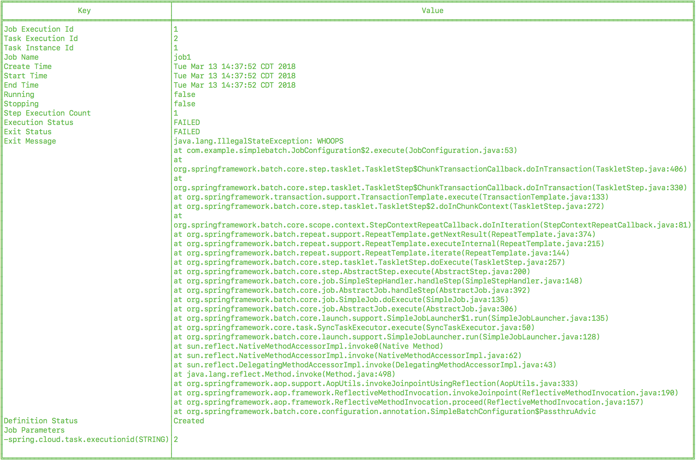

[[task-dev-guide]]
= Task Developer Guide

This section covers how to create, test, and run Spring Cloud Task applications on your local machine.
It also shows how to map these applications into Spring Cloud Data Flow and deploy them.

[[task-dev-guide-prebuilt-apps]]
== Prebuilt Applications

The link:https://cloud.spring.io/spring-cloud-task-app-starters/[Spring Cloud Task App Starters] project provides many applications that you can start using right away.
For example, there is a timestamp application that prints the timestamp to the console.
All the applications are based on link:https://projects.spring.io/spring-boot/[Spring Boot] and link:https://cloud.spring.io/spring-cloud-task/[Spring Cloud Task].

Applications are published as Maven artifacts as well as Docker images.
For GA releases, the Maven artifacts are published to Maven central and the link:https://repo.spring.io/release[Spring Release Repository].
Milestone and snapshot releases are published to the link:https://repo.spring.io/milestone[Spring Milestone] and link:https://repo.spring.io/snapshot[Spring Snapshot] repositories, respectively.
Docker images are pushed to link:https://hub.docker.com/u/springcloudtask/[Docker Hub]

The root location of the Spring Repository that hosts the GA artifacts of prebuilt applications is https://repo.spring.io/release/org/springframework/cloud/task/app/

[[task-dev-guide-running-prebuilt-apps]]
== Running Prebuilt Applications

You can run the timestamp application by using `java -jar`.

To get started, download the sample application, as follows:

[source,bash]
wget https://repo.spring.io/libs-release/org/springframework/cloud/task/app/timestamp-task/1.3.0.RELEASE/timestamp-task-1.3.0.RELEASE.jar

That file contains a Spring Boot applications that includes the link:https://docs.spring.io/spring-boot/docs/current/reference/html/production-ready.html[Spring Boot Actuator] and the link:https://docs.spring.io/spring-boot/docs/current/reference/html/boot-features-security.html[Spring Security Starter].
You can specify link:https://docs.spring.io/spring-boot/docs/current/reference/html/common-application-properties.html[common Spring Boot properties] to configure each application.

Now you can run the timestamp application, as follows:

[source,bash]
java -jar timestamp-task-1.3.0.RELEASE.jar --logging.level.org.springframework.cloud.task=DEBUG

NOTE: The `--logging.level.org.springframework.cloud.task=DEBUG` option lets you see output that would not otherwise be written to the console. Because Spring Cloud Task uses an in-memory database to store its results (and that in-memory database is destroyed at the end of the run), the `DEBUG` option is the only way to see the output from the timestamp task.

The timestamp application shows the following output (in the midst of much other output):

[source,bash]
----
2018-03-12 13:45:14.583  INFO 4810 --- [           main] TimestampTaskConfiguration$TimestampTask : 2018-03-12 13:45:14.583
2018-03-12 13:45:14.609 DEBUG 4810 --- [           main] o.s.c.t.r.support.SimpleTaskRepository   : Updating: TaskExecution with executionId=1 with the following {exitCode=0, endTime=Mon Mar 12 13:45:14 CDT 2018, exitMessage='null', errorMessage='null'}
----

The first line shows the timestamp generated by the Timestamp task. The second line shows an exit code of 0 and no error. Had an error occurred, the exit code would be something other than 0, and the `errorMessage` would show the exception that was thrown.

If you have debug mode turned on, you can get even more information, in a line similar to the following (which appears just prior to the timestamp if you have debug mode turned on):

`2018-03-14 13:47:16.659 DEBUG 78382 --- [ main] o.s.c.t.r.support.SimpleTaskRepository : Creating: TaskExecution{executionId=0, parentExecutionId=null, exitCode=null, taskName='application', startTime=Wed Mar 14 13:47:16 EDT 2018, endTime=null, exitMessage='null', externalExecutionId='null', errorMessage='null', arguments=[]}`

[[task-dev-guide-building-timestamp-task]]
== Building a Timestamp Task

To build your own timestamp task, follow each of these procedures:

. <<task-dev-guide-building-timestamp-task-setting-up-environment>>
. <<task-dev-guide-building-timestamp-task-getting-started>>
. <<task-dev-guide-building-timestamp-task-making-boot-task>>
. <<task-dev-guide-building-timestamp-task-recording-error>>
. <<task-dev-guide-building-timestamp-task-adding-pre-post-processing>>
. <<task-dev-guide-building-timestamp-task-bonus-adding-mysql>>

[[task-dev-guide-building-timestamp-task-setting-up-environment]]
=== Setting up the Environment

Before we can do anything else, we have to set up our work environment. First, we must install RabbitMQ, as described https://github.com/cppwfs/DNDataflow/blob/master/labs/InstallRabbitnMQ.pdf[in this document].
Then we need to create a directory and add a starter project (which we created to simplify this setup). To do so:

. From the command line, run `git clone https://github.com/cppwfs/DNDataflow.git`.
. From the command line, run `cd DNDataflow`.

[[task-dev-guide-building-timestamp-task-getting-started]]
=== Getting Started

To get started on making a task, we must first make a Spring Boot application. The DNDataflow project that we cloned in the preceding section took care of that for us, but we need to build and run it, as follows:

. From the command line, run `cd labs/lab2`.
. From the command line, run `mvn clean package`.
+
You should see a typical set of Maven build output for a Spring Boot application.
. From the command line, run  `java -jar target/tasklab-0.0.1-SNAPSHOT.jar`.
+
You should see a Spring application start, print "`Hello World`" to the console, and stop.

[[task-dev-guide-building-timestamp-task-making-boot-task]]
=== Making a Spring Boot Application into a Spring Cloud Task

Now that we have a Boot Application, we can turn it into a Spring Cloud Task, to make the following changes:

* Add a `starter-task` dependency (which makes a Spring Boot application into a Spring Cloud Task in the `pom.xml` file).
* Add an H2 (in-memory database), because all Spring Cloud Task applications require a database.
* Add the `@EnableTask` annotation (which makes a Spring Boot application into a Spring Cloud Task in Java).

To do all that:

. Open the `pom.xml` file.
. At line 34, add the following block:
+
[source,xml]
----
<dependency>
  <groupId>org.springframework.cloud</groupId>
  <artifactId>spring-cloud-starter-task</artifactId>
</dependency>
<dependency>
  <groupId>com.h2database</groupId>
  <artifactId>h2</artifactId>
</dependency>
<dependency>
  <groupId>org.springframework.boot</groupId>
  <artifactId>spring-boot-starter-jdbc</artifactId>
</dependency>
----
. Save your changes to `pom.xml`.
. Open `src/main/java/io/spring/TasklabApplication.java` in either an IDE or a text editor.
. On Line 13, add the `@EnableTask` annotation.
+
NOTE: If you do not use an IDE, you also need to un-comment lines 6 through 9.
. Save your changes to `TasklabApplication.java`.
. Open `src/main/resources/application.properties`.
. Add the following properties:
+
----
logging.level.org.springframework.cloud.task=DEBUG
spring.application.name=lab2-task
----
+
Setting the logging level for the task to `DEBUG` creates output to let us know that the task works.
Setting the application name lets us store a meaningful name in the database, so that we can find our task in the `TASK_EXECUTION` table.
. Save your change to `application.properties`.

Now that we have made our changes, we naturally want to run it and see it work. To do so:

. From the command line, run `mvn clean package`.
+
You should see a typical set of Maven build output for a Spring Boot application (with some additional output, because it is now a Spring Cloud Task).
. From the command line, run `java -jar target/tasklab-0.0.1-SNAPSHOT.jar`.
+
You should see output for a typical (though very basic) Spring Cloud Task, including a line similar to (differing only by its timestamp) the following:
+
`2018-03-12 15:13:48.930 DEBUG 5202 --- [           main] o.s.c.t.r.support.SimpleTaskRepository   : Creating: TaskExecution{executionId=0, exitCode=null, taskName='lab2-task', startTime=Mon Mar 12 15:13:48 CDT 2018, endTime=null, exitMessage='null', errorMessage='null', arguments=[]}`

[[task-dev-guide-building-timestamp-task-recording-error]]
=== Recording an Error

Now that we have a working task, we can intentionally create an error, to show how a Spring Cloud Task handles errors. To do so:

. Open `src/main/java/io/spring/TasklabApplication.java` in either an IDE or a text editor.
. Copy the following line into the file at line 26:
+
[source,java]
throw new IllegalStateException("No Task For You!");
. From the command line, run `mvn clean package -DSkipTests`.
+
NOTE: We must add `-DSkipTests`, because the tests would catch the Exception we added and prevent us from seeing it.
. From the command line, run `java -jar target/tasklab-0.0.1-SNAPSHOT.jar`.
+
Now we can see the Exception we added coming through in the output, as an Exception with a stack trace.
. Remove or comment out the Exception that we throw on line 26 (so that the next lessons work correctly).

[[task-dev-guide-building-timestamp-task-adding-pre-post-processing]]
=== Adding Pre- and Post-processing

Spring Cloud Task includes the ability to run additional processing both before and after the task. To add both features to our current sample application:

. Open `src/main/java/io/spring/TasklabApplication.java` in either an IDE or a text editor.
. Copy the following code below line 30:
+
[source,java]
----
@BeforeTask
public void beforeTask(TaskExecution taskExecution) {
  System. out.println("Before TASK");
}

@AfterTask
public void afterTask(TaskExecution taskExecution) {
  System. out.println("After TASK");
}
----
. From the command line, run `mvn clean package`.
. From the command line, run `java -jar target/tasklab-0.0.1-SNAPSHOT.jar`.
+
Now the output includes lines that print both `BEFORE TASK` and `AFTER TASK`.

[[task-dev-guide-building-timestamp-task-bonus-adding-mysql]]
=== Bonus Step: Adding a MySQL Database

Nearly always, a real-world Spring Cloud Task needs to use a persistent (rather than an in-memory) database.
In this example, we show how to add a MySQL database (MariaDB) to our Task.
To do so:

. Open the `pom.xml` file.
. On line 46, add the following dependency:
+
[source,xml]
----
<dependency>
  <groupId>org.mariadb.jdbc</groupId>
  <artifactId>mariadb-java-client</artifactId>
</dependency>
----
. From the command line, run `mvn clean package`.
. From the command line, run `java -jar target/tasklab-0.0.1-SNAPSHOT.jar`.
+
If you examine the contents of your database, you should now see the task in the `TASK_EXECUTION` table.

== Adding Spring Cloud Task to a Spring Batch Application

NOTE: This project expects that you have completed the <<task-dev-guide-building-timestamp-task,previous project>>.

You can use Spring Cloud Task within a Spring Batch application.
In fact, that was a key goal of Spring Could Task.
Because a Task has a finite duration (that is, it is not a continuing process), it is a natural fit for Spring Batch, which naturally deals with processes that have finite durations.

This guide walks through integrating Spring Cloud Task with Spring Batch in a sample application.
It consists of the following procedures:

. <<task-dev-guide-building-batch-task-setting-up-environment>>
. <<task-dev-guide-building-batch-task-creating-first-task>>
. <<task-dev-guide-building-batch-task-creating-first-batch-task>>

[[task-dev-guide-building-batch-task-setting-up-environment]]
=== Setting up the Environment

Before we can do anything else, we have to set up our work environment. First, we must install RabbitMQ, as described https://github.com/cppwfs/DNDataflow/blob/master/labs/InstallRabbitnMQ.pdf[in this document].
Then we need to create a directory and add a starter project (which we created to simplify this setup). To do so:

. From the command line, run `git clone https://github.com/cppwfs/DNDataflow.git`.
. From the command line, run `cd DNDataflow`.

[[task-dev-guide-building-batch-task-creating-first-task]]
=== Creating Your First Task

If you have not already done so, install Spring Cloud Data Flow.
https://github.com/cppwfs/DNDataflow/blob/master/labs/lab3/Lab3-InstallDataFlow.pdf[This document] walks through how to do so.

Once you have Spring Cloud Data Flow Server and Shell running, you can use the following procedure to create your first task:

. Register a basic suite of tasks by importing their registrations through the Spring Cloud Data Flow Shell with the following command:
+
`app register --name timestamp --type task --uri maven://org.springframework.cloud.task.app:timestamp-task:1.3.0.RELEASE`
+
NOTE: This example shows how to register a task from a Maven repository.
. Verify that the timestamp-task app registered by running the following command in the Spring Cloud Data Flow Shell:
+
`app list`
+
The following output should appear:
+
image:images/dataflow-shell-app-list.png[]
. Create a task definition that uses timestamp task by using the following command in the Spring Cloud Data Flow Shell:
+
`task create --name myStamp --definition "timestamp"`
+
You should see a message saying "Created new task 'myStamp'".
. Launch your new task by using the following command:
+
`task launch myStamp`
+
You should see a message saying "Launched task `myStamp`".
. Verify that your task was successfully run by running the following command in the Spring Cloud Data Flow Shell:
`task execution list`
+
You should see output similar to the following:
+
image:images/dataflow-task-execution-list-timestamp.png[]
+
The exit code of 0 tells us that the task ran without errors.

[[task-dev-guide-building-batch-task-creating-first-batch-task]]
=== Creating Your First Batch-Task

Essentially, a Batch-Task is a Spring Batch application that includes the `@EnableTask` annotation, which serves as an indicator that the Spring Batch application uses Spring Cloud Task.
Spring Boot takes care of the rest of the set up for us.
We often call it "`Taskifying a Batch.`"
To taskify your first batch:

. In Spring Cloud Data Flow Shell, register a Spring Batch-Task application by using the following command:
+
`app register --name batch-events --type task --uri file:///<FOLDER>/DNDataflow/labs/jars/simplebatch-0.0.1-SNAPSHOT.jar`
+
where `<Folder>` is where you stored your work from the <<task-dev-guide-building-timestamp-task,previous project>>.
+
NOTE: This example shows how to use the `file` protocol.
When you do so, you must use the fully qualified path.
. To verify that your application has been registered, run the following command in the Spring Cloud Data Flow Shell:
+
`app list`
+
You should see output similar to the following:
+
image:images/dataflow-app-list-batch-event.png[]
+
NOTE: Timestamp still appears because we did not clear the database after the previous exercise.
Its presence does no harm, and having multiple applications is more realistic.
. Create a task definition that uses the batch-events task, by running the following command:
+
`task create --name myBatchTask --definition "batch-events"`
+
You should see a message saying "Created new task 'myBatchTask'".
. Launch your batch-task by running the following command:
+
`task launch myBatchTask`
+
You should see a message saying "Launched task `myBatchTask`".
. Verify that the task ran, run the following command:
+
`task execution list`
+
You should see output similar to the following:
+
image:images/dataflow-task-execution-list-batch-events.png[]
+
We can now verify that the task worked as a batch job. The <<task-dev-guide-building-batch-task-verify-batch-task,next section>> describes how to do so.

[[task-dev-guide-building-batch-task-verify-batch-task]]
==== Verifying that Your Task is a Batch

When you create and run a Batch-Task, it is both a Spring Cloud Task instance and a Spring Batch instance.
In the <<task-dev-guide-building-batch-task-creating-first-batch-task,previous section>>, we saw how to verify that your first batch-task worked as a batch.
This section steps through how to verify that it also worked as a batch.
To do so:

. Run the following command to see the list of jobs that have run:
+
`job execution list`
+
You should see output similar to the following:
+
image:images/dataflow-job-execution-list.png[]
. Note the Job ID from the ID column (in this case, we want to look at `2`).
. To get the details of the job execution, we can use the Job ID in the following command:
+
`job execution display --id 2`
+
You should see output similar to the following:
+
image:images/dataflow-job-execution-details.png[]

NOTE: We built the demo from which this documentation gets its images such that it creates two jobs.
The first of those jobs always fails, because we intentionally throw an exception in it.
Doing so lets us test the job output, and it lets us show you what a failed job looks like.

To see the failed job's details, run the following command in the Spring Cloud Data Flow Shell:

`job execution display --id 1`

You should see output similar to the following:

