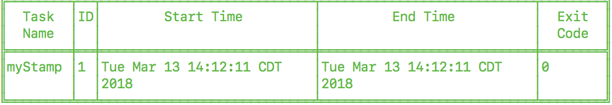
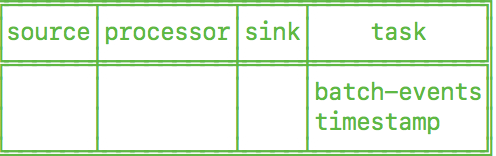
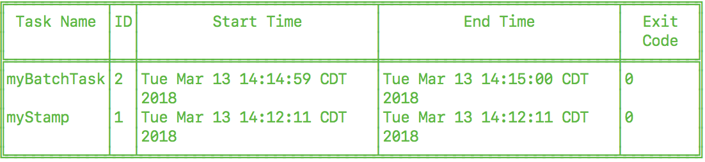
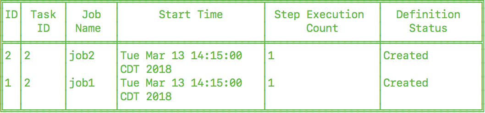
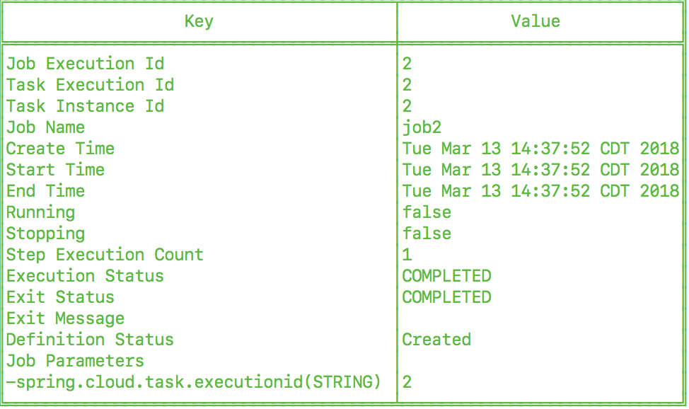

[[task-dev-guide]]
= Task Developer Guide

This section covers how to create, test, and run Spring Cloud Task applications on your local machine.
It also shows how to map these applications into Spring Cloud Data Flow and deploy them.

[[task-dev-guide-prebuilt-apps]]
== Prebuilt Applications

The link:https://cloud.spring.io/spring-cloud-task-app-starters/[Spring Cloud Task App Starters] project provides many applications that you can start using right away.
For example, there is a timestamp application that prints the timestamp to the console.
All the applications are based on link:https://projects.spring.io/spring-boot/[Spring Boot] and link:https://cloud.spring.io/spring-cloud-task/[Spring Cloud Task].

Applications are published as Maven artifacts as well as Docker images.
For GA releases, the Maven artifacts are published to Maven central and the link:https://repo.spring.io/release[Spring Release Repository].
Milestone and snapshot releases are published to the link:https://repo.spring.io/milestone[Spring Milestone] and link:https://repo.spring.io/snapshot[Spring Snapshot] repositories, respectively.
Docker images are pushed to link:https://hub.docker.com/u/springcloudtask/[Docker Hub]

The root location of the Spring Repository that hosts the GA artifacts of prebuilt applications is https://repo.spring.io/release/org/springframework/cloud/task/app/

[[task-dev-guide-running-prebuilt-apps]]
== Running Prebuilt Applications

You can run the timestamp application by using `java -jar`.

To get started, download the sample application, as follows:

[source,bash]
wget https://repo.spring.io/libs-release/org/springframework/cloud/task/app/timestamp-task/1.3.0.RELEASE/timestamp-task-1.3.0.RELEASE.jar

That file contains a Spring Boot applications that includes the link:{spring-boot-docs-reference}/html/production-ready.html[Spring Boot Actuator] and the link:{spring-boot-docs-reference}/html/boot-features-security.html[Spring Security Starter].
You can specify link:{spring-boot-docs-reference}/html/common-application-properties.html[common Spring Boot properties] to configure each application.

Now you can run the timestamp application, as follows:

[source,bash]
java -jar timestamp-task-1.3.0.RELEASE.jar --logging.level.org.springframework.cloud.task=DEBUG

NOTE: The `--logging.level.org.springframework.cloud.task=DEBUG` option lets you see output that would not otherwise be written to the console. Because Spring Cloud Task uses an in-memory database to store its results (and that in-memory database is destroyed at the end of the run), the `DEBUG` option is the only way to see the output from the timestamp task.

The timestamp application shows the following output (in the midst of much other output):

[source,bash]
----
2018-03-12 13:45:14.583  INFO 4810 --- [           main] TimestampTaskConfiguration$TimestampTask : 2018-03-12 13:45:14.583
2018-03-12 13:45:14.609 DEBUG 4810 --- [           main] o.s.c.t.r.support.SimpleTaskRepository   : Updating: TaskExecution with executionId=1 with the following {exitCode=0, endTime=Mon Mar 12 13:45:14 CDT 2018, exitMessage='null', errorMessage='null'}
----

The first line shows the timestamp generated by the Timestamp task. The second line shows an exit code of 0 and no error. Had an error occurred, the exit code would be something other than 0, and the `errorMessage` would show the exception that was thrown.

If you have debug mode turned on, you can get even more information, in a line similar to the following (which appears just prior to the timestamp if you have debug mode turned on):

`2018-03-14 13:47:16.659 DEBUG 78382 --- [ main] o.s.c.t.r.support.SimpleTaskRepository : Creating: TaskExecution{executionId=0, parentExecutionId=null, exitCode=null, taskName='application', startTime=Wed Mar 14 13:47:16 EDT 2018, endTime=null, exitMessage='null', externalExecutionId='null', errorMessage='null', arguments=[]}`

[[task-dev-guide-building-timestamp-task]]
== Building a Timestamp Task

To build your own timestamp task, follow each of these procedures:

. <<task-dev-guide-building-timestamp-task-from-initializr>>
. <<task-dev-guide-building-timestamp-task-recording-error>>
. <<task-dev-guide-building-timestamp-task-adding-pre-post-processing>>
. <<task-dev-guide-building-timestamp-task-bonus-adding-mysql>>
. <<task-dev-guide-building-timestamp-adding-tasks-to-dataflow>>

[[task-dev-guide-building-timestamp-task-from-initializr]]
== Developing Your Timestamp Application

So now that we've used a pre-built timestamp task application, let's create one of our own.

[[task-dev-guide-creating-project]]
=== Creating the Spring Task Project using Spring Initializr
Now let's create and test an application that prints the current time to the console.

To do so:

. Visit the link:https://start.spring.io/[Spring Initialzr] site.
.. Create a new Maven or Gradle project with a *Group* name of `io.spring.task.sample` and an *Artifact* name of `timestamp`.
.. In the Dependencies text box, type `task` to select the `Cloud Task` dependency.
.. In the Dependencies text box, type `jdbc` then select the `JDBC` dependency.
.. In the Dependencies text box, type `h2` then select the `H2`. (or your favorite database)
.. Click the *Generate Project* button
. Unzip the timestamp.zip file and import the project into your favorite IDE.

[[getting-started-writing-the-code]]
=== Writing the Code

To finish our application, we need to modify the generated `TimestampApplication` code with the following contents so that it will launch a Task.
[source,java]
----
package io.spring.task.sample.timestamp;

import java.text.DateFormat;
import java.text.SimpleDateFormat;
import java.util.Date;

import org.springframework.boot.CommandLineRunner;
import org.springframework.boot.SpringApplication;
import org.springframework.boot.autoconfigure.SpringBootApplication;
import org.springframework.cloud.task.configuration.EnableTask;
import org.springframework.context.annotation.Bean;

@SpringBootApplication
@EnableTask
public class TimestampApplication {

	@Bean
	public CommandLineRunner commandLineRunner() {
		return new TimestampCommandLineRunner();
	}

	public static void main(String[] args) {
		SpringApplication.run(TimestampApplication.class, args);
	}

	public static class TimestampCommandLineRunner implements CommandLineRunner {

		@Override
		public void run(String... strings) throws Exception {
			DateFormat dateFormat = new SimpleDateFormat("YYYY-MM-dd HH:ss");
			System.out.println(dateFormat.format(new Date()));
		}
	}
}
----

The https://docs.spring.io/spring-cloud-task/docs/2.0.0.RELEASE/reference/htmlsingle/#getting-started-at-task[@EnableTask] annotation sets up `TaskRepository` which stores information about the task execution such as the start and end time of the task and the exit code.

In our demo, the `TaskRepository` uses an embedded H2 database to record the results
of a task.
This H2 embedded database is not a practical solution for a production environment, since
the H2 database goes away once the task ends.
However, for a quick getting-started experience, we will use this in our example as well as echoing to the logs what is being updated in that repository.

The https://docs.spring.io/spring-boot/docs/current/reference/htmlsingle/#boot-features-command-line-runner[CommandLineRunner] is a Spring Boot interface that tells Boot to execute the code in the `run` method once.
When our sample application runs, Spring Boot launches our `TimestampCommandLineRunner`
and outputs our timestamp message to standard out.

NOTE: Any processing bootstrapped from mechanisms other than a `CommandLineRunner` or
`ApplicationRunner` (by using `InitializingBean#afterPropertiesSet` for example) is not
 recorded by Spring Cloud Task.

Now let's open the `application.properties` file in `src/main/resources` and configure two properties, the application name and logging.
The application name is also used as the name of the task.
The logging level is set to `DEBUG` so we can see more information on what is going on internally.

[source]
----
logging.level.org.springframework.cloud.task=DEBUG
spring.application.name=timestamp
----

[[getting-started-running-the-example]]
=== Running the Example

At this point, our application should work.  Since this application is Spring Boot-based,
we can run it from the command line by using `./mvnw spring-boot:run` from the root
of our application, as shown (with its output) in the following example:

[source]
----
$ ./mvnw clean spring-boot:run
....... . . .
....... . . . (Maven log output here)
....... . . .

  .   ____          _            __ _ _
 /\\ / ___'_ __ _ _(_)_ __  __ _ \ \ \ \
( ( )\___ | '_ | '_| | '_ \/ _` | \ \ \ \
 \\/  ___)| |_)| | | | | || (_| |  ) ) ) )
  '  |____| .__|_| |_|_| |_\__, | / / / /
 =========|_|==============|___/=/_/_/_/
 :: Spring Boot ::        (v2.0.3.RELEASE)

2018-07-26 12:01:47.236  INFO 93883 --- [           main] i.s.t.s.timestamp.TimestampApplication   : Starting TimestampApplication on Glenns-MacBook-Pro-2.local with PID 93883 (/Users/glennrenfro/project/timestamp/target/classes started by glennrenfro in /Users/glennrenfro/project/timestamp)
2018-07-26 12:01:47.241  INFO 93883 --- [           main] i.s.t.s.timestamp.TimestampApplication   : No active profile set, falling back to default profiles: default
2018-07-26 12:01:47.280  INFO 93883 --- [           main] s.c.a.AnnotationConfigApplicationContext : Refreshing org.springframework.context.annotation.AnnotationConfigApplicationContext@50b87e67: startup date [Thu Jul 26 12:01:47 EDT 2018]; root of context hierarchy
2018-07-26 12:01:47.989  INFO 93883 --- [           main] o.s.j.d.e.EmbeddedDatabaseFactory        : Starting embedded database: url='jdbc:h2:mem:testdb;DB_CLOSE_DELAY=-1;DB_CLOSE_ON_EXIT=false', username='sa'
2018-07-26 12:01:48.144 DEBUG 93883 --- [           main] o.s.c.t.c.SimpleTaskConfiguration        : Using org.springframework.cloud.task.configuration.DefaultTaskConfigurer TaskConfigurer
2018-07-26 12:01:48.145 DEBUG 93883 --- [           main] o.s.c.t.c.DefaultTaskConfigurer          : No EntityManager was found, using DataSourceTransactionManager
2018-07-26 12:01:48.227 DEBUG 93883 --- [           main] o.s.c.t.r.s.TaskRepositoryInitializer    : Initializing task schema for h2 database
2018-07-26 12:01:48.229  INFO 93883 --- [           main] o.s.jdbc.datasource.init.ScriptUtils     : Executing SQL script from class path resource [org/springframework/cloud/task/schema-h2.sql]
2018-07-26 12:01:48.261  INFO 93883 --- [           main] o.s.jdbc.datasource.init.ScriptUtils     : Executed SQL script from class path resource [org/springframework/cloud/task/schema-h2.sql] in 32 ms.
2018-07-26 12:01:48.407  INFO 93883 --- [           main] o.s.j.e.a.AnnotationMBeanExporter        : Registering beans for JMX exposure on startup
2018-07-26 12:01:48.412  INFO 93883 --- [           main] o.s.c.support.DefaultLifecycleProcessor  : Starting beans in phase 0
2018-07-26 12:01:48.428 DEBUG 93883 --- [           main] o.s.c.t.r.support.SimpleTaskRepository   : Creating: TaskExecution{executionId=0, parentExecutionId=null, exitCode=null, taskName='timestamp', startTime=Thu Jul 26 12:01:48 EDT 2018, endTime=null, exitMessage='null', externalExecutionId='null', errorMessage='null', arguments=[]}
2018-07-26 12:01:48.439  INFO 93883 --- [           main] i.s.t.s.timestamp.TimestampApplication   : Started TimestampApplication in 1.464 seconds (JVM running for 4.233)
2018-07-26 12:48
2018-07-26 12:01:48.457 DEBUG 93883 --- [           main] o.s.c.t.r.support.SimpleTaskRepository   : Updating: TaskExecution with executionId=1 with the following {exitCode=0, endTime=Thu Jul 26 12:01:48 EDT 2018, exitMessage='null', errorMessage='null'}
----

The preceding output has three lines that of interest to us here:

* `SimpleTaskRepository` logged the creation of the entry in the `TaskRepository`.
* The execution of our `CommandLineRunner`, demonstrated by the timestamp output.
* `SimpleTaskRepository` logs the completion of the task in the `TaskRepository`.

[[task-dev-guide-building-timestamp-task-recording-error]]
=== Recording an Error

Now that we have a working task, we can intentionally create an error, to show how a Spring Cloud Task handles errors. To do so:

. Open `src/main/java/io/spring/task/sample/timestamp/TimestampApplication.java` and insert the following line into the run method:
+
[source,java]
throw new IllegalStateException("No Task For You!");
. From the command line, run `./mvnw clean spring-boot:run -DskipTests`.
+
NOTE: We must add `-DskipTests`, because the tests would catch the Exception we added and prevent us from seeing it.
+
Now we can see the Exception we added coming through in the output, as an Exception with a stack trace.  Task has now captured this exception and recorded it to the database. This can be seen in the console as shown here:
+
[source]
----
Updating: TaskExecution with executionId=1 with the following {exitCode=1, endTime=Wed Jul 25 12:42:15 EDT 2018, exitMessage='null', errorMessage='java.lang.IllegalStateException: Failed to execute CommandLineRunner
...
----
+
. Remove or comment out the Exception so that the next lessons work correctly.

[[task-dev-guide-building-timestamp-task-adding-pre-post-processing]]
=== Adding Pre- and Post-processing

Spring Cloud Task includes the ability to run additional processing both before and after the task. To add both features to our current sample application:

. Open `src/main/java/io/spring/TimestampApplication.java` and add the following code to the TimestampCommandLineRunner:
+
[source,java]
----
@BeforeTask
public void beforeTask(TaskExecution taskExecution) {
  System. out.println("Before TASK");
}

@AfterTask
public void afterTask(TaskExecution taskExecution) {
  System. out.println("After TASK");
}
----
. From the command line, run `./mvnw clean spring-boot:run`.
+
Now the output includes lines that print both `BEFORE TASK` and `AFTER TASK`.

[[task-dev-guide-building-timestamp-task-bonus-adding-mysql]]
=== Adding a MySQL Database

Nearly always, a real-world Spring Cloud Task needs to use a persistent (rather than an in-memory) database.
In this example, we show how to add a MySQL database (MariaDB) to our Task.
To do so:

. Open the `pom.xml` file.
. Add the following dependency:
+
[source,xml]
----
<dependency>
  <groupId>org.mariadb.jdbc</groupId>
  <artifactId>mariadb-java-client</artifactId>
</dependency>
----
. From your command line set up the database connection properties for MySql for example
+
[source]
----
export spring_datasource_url=jdbc:mysql://localhost:3306/practice
export spring_datasource_username=root
export spring_datasource_password=password
export spring_datasource_driverClassName=org.mysql.jdbc.Driver
----
. From the command line, run `./mvnw clean spring-boot:run`.
+
If you examine the contents of your database, you should now see the task in the `TASK_EXECUTION` table.

[[task-dev-guide-building-timestamp-adding-tasks-to-dataflow]]
== Adding and Launching Spring Cloud Tasks with Data Flow

This guide walks through registering and launching a Spring Cloud Task application.
It consists of the following procedures:

. <<task-dev-guide-building-batch-task-creating-first-task>>
. <<task-dev-guide-building-batch-task-creating-first-batch-task>>

[[task-dev-guide-building-batch-task-creating-first-task]]
=== Registering and Launching Your First Task

Once you have Spring Cloud Data Flow Server and Shell running, you can use the following procedure to create your first task:

. Register a basic suite of tasks by importing their registrations through the Spring Cloud Data Flow Shell with the following command:
+
`app register --name timestamp --type task --uri maven://org.springframework.cloud.task.app:timestamp-task:1.3.0.RELEASE`
+
NOTE: This example shows how to register a task from a Maven repository.
. Verify that the timestamp-task app registered by running the following command in the Spring Cloud Data Flow Shell:
+
`app list`
+
The following output should appear:
+
image:images/dataflow-shell-app-list.png[]
. Create a task definition that uses timestamp task by using the following command in the Spring Cloud Data Flow Shell:
+
`task create --name myStamp --definition "timestamp"`
+
You should see a message saying "Created new task 'myStamp'".
. Launch your new task by using the following command:
+
`task launch myStamp`
+
You should see a message saying "Launched task `myStamp`".
. Verify that your task was successfully run by running the following command in the Spring Cloud Data Flow Shell:
`task execution list`
+
You should see output similar to the following:
+

+
The exit code of 0 tells us that the task ran without errors.

[[task-dev-guide-building-batch-task-creating-first-batch-task]]
=== Registering and Launching Your First Spring Batch-Task

Essentially, a Batch-Task is a Spring Batch application that includes the `@EnableTask` annotation, which serves as an indicator that the Spring Batch application uses Spring Cloud Task.
Spring Boot takes care of the rest of the set up for us.

To register your first Spring Batch Task:

. In Spring Cloud Data Flow Shell, register a Spring Batch Task application by using the following command:
+
`app register --name batch-events --type task --uri maven://org.springframework.cloud.task.app:timestamp-batch-task:2.0.0.RELEASE`
+
. To verify that your application has been registered, run the following command in the Spring Cloud Data Flow Shell:
+
`app list`
+
You should see output similar to the following:
+

+
. Create a task definition that uses the batch-events task, by running the following command:
+
`task create --name myBatchTask --definition "batch-events"`
+
You should see a message saying "Created new task 'myBatchTask'".
. Launch your batch-task by running the following command:
+
`task launch myBatchTask`
+
You should see a message saying "Launched task `myBatchTask`".
. Verify that the task ran, run the following command:
+
`task execution list`
+
You should see output similar to the following:
+

+
We can now verify that the task worked as a batch job. The <<task-dev-guide-building-batch-task-verify-batch-task,next section>> describes how to do so.

[[task-dev-guide-building-batch-task-verify-batch-task]]
==== Verifying that Your Task is a Batch

When you create and run a Batch-Task, it is both a Spring Cloud Task instance and a Spring Batch instance.
In the <<task-dev-guide-building-batch-task-creating-first-batch-task,previous section>>, we saw how to verify that your first batch-task worked as a task.
This section steps through how to verify that it also worked as a batch.
To do so:

. Run the following command to see the list of jobs that have run:
+
`job execution list`
+
You should see output similar to the following:
+

. Note the Job ID from the ID column (in this case, we want to look at `2`).
. To get the details of the job execution, we can use the Job ID in the following command:
+
`job execution display --id 1`
+
You should see output similar to the following:
+

[[task-dev-guide-database-requirement]]
== Database Requirement for running tasks in Spring Cloud Data Flow
As previously discussed Spring Cloud Task records the state of each task execution to a relational database.
And as such Spring Cloud Data Flow uses this recorded information when users request task or batch job execution information.
Also Spring Batch and Spring Cloud Task offer features that allow Spring Cloud Data Flow to communicate certain start or stop behaviors.
One example is when a user utilizes the Spring Cloud Data Flow UI to stop a Spring Batch app execution.
